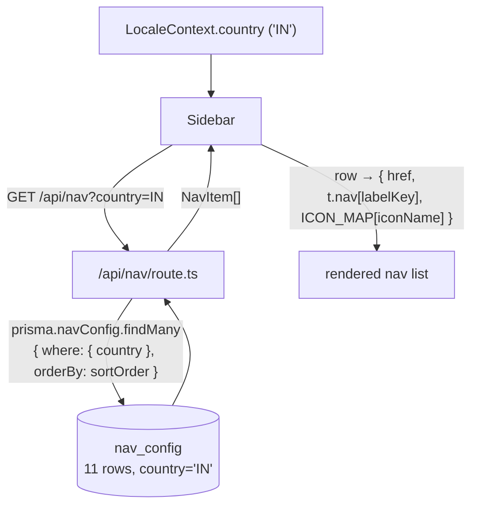

# Country → Sidebar Nav Mapping — Design

**Date:** 2026-09-10

## Problem

The sidebar navigation is meant to be a per-country set of menu items, but that never
worked:

- The `NavConfig` Prisma model was deleted in commit `f589006`. `src/app/api/nav/route.ts`
  still calls `prisma.navConfig.findMany`, so it throws `TypeError` → HTTP 500 on every
  request. `Sidebar.tsx` turns the 500 into `[]`, so **the sidebar nav is empty for
  every signed-in user**. (Tracked in project memory `api-nav-broken-deferred`.)
- Even before it broke, every seeded row was `country: 'ALL'` — the `country` filter
  existed but was never used with country-specific data. Only the ℹ info banner on each
  category *page* (`categoryInfo.ts`) varied by country.

We want the sidebar items — **which items, their order, their labels, and their icons** —
to be driven by the user's country, starting with India.

## Goal

1. Restore `NavConfig` as a real per-country table, seed India's 11 rows.
2. `/api/nav` returns the requested country's rows (falling back to India for any
   country with no rows — see **Fallback**).
3. Refresh 4 category icons to fit their category better.
4. Sidebar renders the result. No visible 500s.

**Non-goals:**

- Any country other than India. `COUNTRIES` in `src/i18n/countries.ts` only has `IN`
  uncommented; the settings dropdown only offers India. When another country is added
  it gets its own `nav_config` rows then.
- Changing the set of categories (still the current 11) or their order.
- Changing labels per country — labels stay keyed (`labelKey` → `t.nav[key]`), translated
  by *language*. A future country wanting different wording adds a new `t.nav` key.
- Fixing the rest of `prisma/seed.ts` (references ~10 other deleted models — out of scope).
- An admin UI for editing nav rows.

---

## 1. Data model

### `frontend/prisma/schema.prisma` — restore `NavConfig`

```prisma
model NavConfig {
  id        String @id @default(uuid())
  country   String
  href      String
  labelKey  String
  iconName  String
  sortOrder Int    @default(0)

  @@unique([country, href])
  @@index([country])
  @@map("nav_config")
}
```

Differences from the pre-`f589006` shape: `id` is `String @default(uuid())` (matches
every other model in the current schema — commit `e0b1a71` moved everything off
`Int autoincrement`), plus a `@@unique([country, href])` and `@@index([country])`.

Table created with `npx prisma db push` (the repo has no `migrations/` folder — it uses
`db push`). Then `npx prisma generate`.

### `backend/prisma/schema.prisma` — mirror it

Add the identical `NavConfig` model to the backend schema (the backend is the
DB/migration service; `UserPreference` was kept in sync there the same way).

---

## 2. Seeding

`prisma/seed.ts` is broadly broken and out of scope. Add a **standalone, idempotent**
seed:

### `frontend/prisma/seed-nav.ts` (new)

```ts
import { PrismaClient } from "@prisma/client";

const prisma = new PrismaClient();

const IN_NAV = [
  { href: "/dashboard",          labelKey: "dashboard",         iconName: "LayoutDashboard",  sortOrder: 1  },
  { href: "/stocks",             labelKey: "stocks",            iconName: "CandlestickChart", sortOrder: 2  },
  { href: "/mutual-funds",       labelKey: "mutualFunds",       iconName: "BarChart3",        sortOrder: 3  },
  { href: "/gold-commodities",   labelKey: "goldCommodities",   iconName: "Gem",              sortOrder: 4  },
  { href: "/real-estate",        labelKey: "realEstate",        iconName: "Home",             sortOrder: 5  },
  { href: "/crypto",             labelKey: "cryptocurrency",    iconName: "Bitcoin",          sortOrder: 6  },
  { href: "/insurance",          labelKey: "insurance",         iconName: "Shield",           sortOrder: 7  },
  { href: "/cash-banking",       labelKey: "cashBanking",       iconName: "Wallet",           sortOrder: 8  },
  { href: "/liabilities",        labelKey: "liabilities",       iconName: "HandCoins",        sortOrder: 9  },
  { href: "/fixed-income",       labelKey: "fixedIncome",       iconName: "Vault",            sortOrder: 10 },
  { href: "/government-schemes", labelKey: "governmentSchemes", iconName: "Landmark",         sortOrder: 11 },
];

async function main() {
  await prisma.navConfig.deleteMany({ where: { country: "IN" } });
  await prisma.navConfig.createMany({
    data: IN_NAV.map((r) => ({ ...r, country: "IN" })),
  });
  console.log(`Seeded ${IN_NAV.length} nav_config rows for IN`);
}

main()
  .catch((e) => { console.error(e); process.exit(1); })
  .finally(() => prisma.$disconnect());
```

### `frontend/package.json`

```json
"db:seed-nav": "npx tsx prisma/seed-nav.ts"
```

Run once against the Railway DB after `db push` + `generate`.

The 4 icon changes vs. today: `stocks` → `CandlestickChart` (was `TrendingUp`),
`cash-banking` → `Wallet` (was `Building2`), `liabilities` → `HandCoins` (was
`CreditCard`), `fixed-income` → `Vault` (was `PiggyBank`). All exist in the installed
`lucide-react@0.344.0`.

---

## 3. `src/i18n/navConfig.ts`

Two changes:

1. **`ICON_MAP`** — swap the imports/entries so it holds exactly the icon names the seed
   references (nothing more):

   ```ts
   import {
     LayoutDashboard, CandlestickChart, BarChart3, Gem, Home, Bitcoin,
     Shield, Wallet, HandCoins, Vault, Landmark,
   } from 'lucide-react'
   import type { ElementType } from 'react'

   export const ICON_MAP: Record<string, ElementType> = {
     LayoutDashboard,   // Dashboard
     CandlestickChart,  // Stocks
     BarChart3,         // Mutual Funds
     Gem,               // Gold & Commodities
     Home,              // Real Estate
     Bitcoin,           // Cryptocurrency
     Shield,            // Insurance
     Wallet,            // Cash & Banking
     HandCoins,         // Liabilities
     Vault,             // Fixed Income
     Landmark,          // Government Schemes
   }
   ```

   Removed: `TrendingUp`, `Building2`, `CreditCard`, `PiggyBank` (no row uses them).

2. **`NavItemDto.id`** — `number` → `string` (the model's `id` is now a uuid).

`Sidebar.tsx` already does `ICON_MAP[item.iconName] ?? (() => null)`, so an unknown name
degrades to nothing rather than crashing.

---

## 4. `src/app/api/nav/route.ts`

The current route is:

```ts
import { NextResponse } from 'next/server'
import { getSession } from '@/lib/session'
import { prisma } from '@/lib/prisma'

export async function GET(req: Request) {
  const session = await getSession()
  if (!session.userId) return NextResponse.json([], { status: 401 })

  const { searchParams } = new URL(req.url)
  const country = searchParams.get('country') ?? 'US'

  const rows = await prisma.navConfig.findMany({
    where: { country: { in: ['ALL', country] } },
    orderBy: { sortOrder: 'asc' },
  })

  return NextResponse.json(rows)
}
```

Keep the imports and the `getSession()` / `session.userId` 401 guard **exactly as
written**. Change only: the default `'US'` → `'IN'`, drop the `['ALL', country]` `in`
(there are no `'ALL'` rows), and add the India fallback:

```ts
  const { searchParams } = new URL(req.url)
  const country = searchParams.get('country') ?? 'IN'

  let rows = await prisma.navConfig.findMany({
    where: { country },
    orderBy: { sortOrder: 'asc' },
  })

  // Only India is configured today; anyone whose country was IP-detected as
  // something else still gets a usable sidebar.
  if (rows.length === 0 && country !== 'IN') {
    rows = await prisma.navConfig.findMany({
      where: { country: 'IN' },
      orderBy: { sortOrder: 'asc' },
    })
  }

  return NextResponse.json(rows)
```

(Middleware already gates `/api/nav` and has a carve-out so it works with a locked
vault; that's unchanged.)

---

## 5. `src/components/layout/Sidebar.tsx`

**No change.** It already:

```ts
fetch(`/api/nav?country=${encodeURIComponent(country)}`)
  .then((r) => r.ok ? r.json() : [])
  .then((data: NavItemDto[]) => setNavItems(data))
...
const resolvedNavItems = navItems.map((item) => ({
  href:  item.href,
  label: t.nav[item.labelKey as keyof typeof t.nav] ?? item.labelKey,
  icon:  ICON_MAP[item.iconName] ?? (() => null),
}))
```

It just starts receiving real rows.

`src/middleware.ts` — no change.

---

## 6. Docs

- **`documents/database/nav-config.md`** — table reference (columns, the `(country, href)`
  unique, India's 11 rows), in the style of `documents/database/user-preference.md`.
- **`documents/api/openapi.yaml`** — add `GET /api/nav` (query param `country`, `200` →
  array of nav rows, `401`), plus a `NavItem` schema and a `Navigation` tag. Re-copy
  `openapi.yaml` to `frontend/public/api-docs/` (the doc renders it at runtime now).

---

## 7. Tests

Follow the existing patterns (`tests/database/schema.test.ts`,
`tests/api/preferences/preferences.test.ts` — `describeOrSkip` on `hasTestDb()`,
helpers in `tests/helpers/`).

- **`tests/database/schema.test.ts`** — add a `nav_config table` block: asserts the
  column set/order (`information_schema.columns`), the `(country, href)` unique
  (`P2002` on a duplicate insert), and that 11 rows exist for `country = 'IN'` after
  `ensureReferenceData()` (add nav seeding into that helper, or a dedicated
  `ensureNavData()`).
- **`tests/api/nav/nav.test.ts`** (new) — with a sealed session cookie:
  - `GET /api/nav?country=IN` → `200`, 11 items, `sortOrder` ascending, hrefs match.
  - `GET /api/nav?country=ZZ` → `200`, same 11 (India fallback).
  - `GET /api/nav` with no cookie → `401` (middleware).

---

## 8. Verification (manual)

Signed in, dev server running:

1. Sidebar shows all 11 items in order, with the new icons — Stocks candlestick, Cash &
   Banking wallet, Liabilities hand-coins, Fixed Income vault; the other 7 unchanged.
2. Lock the vault (→ `/unlock`); the sidebar isn't shown there, but `/api/nav` still
   `200`s (middleware carve-out) — no 500 in the dev log on any page.
3. `country` is only ever `IN` from the settings dropdown; confirm the nav still renders
   if `LocaleContext` briefly holds an IP-detected non-IN code (fallback path).
4. `cd frontend && npx tsc --noEmit` — no new errors in `navConfig.ts`, `api/nav/route.ts`.

---

## 9. Follow-up

Update project memory `api-nav-broken-deferred` → resolved (or delete it) once this
ships.

## Data flow


