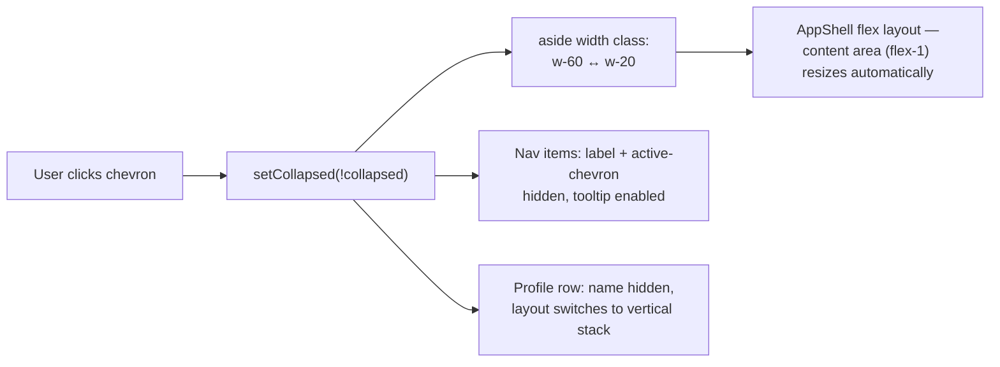

# Sidebar Collapse (Icons-Only) — Design

**Date:** 2026-09-11

## Problem

The sidebar always shows icon + label for every nav item and takes a fixed 240px
(`w-60`) of horizontal space. There's no way to shrink it to reclaim screen space while
keeping navigation available.

## Goal

Add a collapse/expand toggle to the sidebar. Collapsed, nav items show icon only (no
label); clicking a nav icon navigates exactly as it does today. A toggle button switches
between the two states.

**Scope, per the approved mockup and clarifying answers:**

1. **Toggle placement:** a small floating chevron button pinned to the sidebar's right
   border, near the top (Option A from the mockup — VS Code/Notion/Linear style).
2. **State:** local to `Sidebar`, `useState(false)`. **Not persisted** — every fresh
   page load starts expanded, regardless of what was chosen before.
3. **Applies at every breakpoint** — desktop (static sidebar) and the mobile off-canvas
   drawer both support collapsing. This is independent of the existing mobile
   open/close mechanism (`useMobileNav` / the header's hamburger button) — the chevron
   controls *width*, the hamburger controls *open vs. closed*.
4. **Nav items:** icon only, centered, when collapsed. **Hovering shows a tooltip**
   with the label. Click behavior is unchanged in both states.
5. **Profile row:** avatar + plan name (e.g. "Free") when collapsed, stacked
   vertically; the user's full name and the dropdown chevron are hidden (no room).
   Clicking still opens the same popover menu as today, unchanged.
6. **Known, accepted quirk:** the profile popover panel is a fixed 240px-wide panel,
   independent of the sidebar's width already. Collapsed, it still opens at full size,
   anchored to the narrow column and extending over the content area — same pattern
   VS Code/Notion use for collapsed-sidebar menus. Not changed by this design.

**Non-goals:**

- Persisting collapse state (`localStorage`) — explicitly declined.
- Collapsing the profile row to avatar-only with no plan text — declined; plan name
  stays visible.
- Any change to the mobile drawer's open/close mechanism, the backdrop, or the header's
  hamburger button.
- Any change to the profile popover panel's width or anchoring.
- Persisting or syncing collapse state across tabs/devices.

---

## Implementation

Single file: `frontend/src/components/layout/Sidebar.tsx`. No other file changes —
`AppShell`'s flex layout (`<Sidebar />` as a flex sibling of the content area) already
resizes the content area automatically when the sidebar's width class changes; nothing
elsewhere reads or depends on the sidebar's width.

### 1. New state

```tsx
const [collapsed, setCollapsed] = useState(false);
```

Added alongside the existing `useState` block. No effect needed — it's UI-only, no
data dependency, and explicitly not persisted.

### 2. `<aside>` — width + positioning context

Current:
```tsx
<aside
  className={cn(
    "fixed left-0 top-14 bottom-0 z-40 flex w-60 flex-col border-r border-slate-200 bg-white transition-transform duration-200 dark:border-slate-800 dark:bg-slate-950",
    "lg:static lg:top-auto lg:bottom-auto lg:h-full lg:translate-x-0",
    mobileOpen ? "translate-x-0" : "-translate-x-full"
  )}
>
```

New:
```tsx
<aside
  className={cn(
    "fixed left-0 top-14 bottom-0 z-40 flex flex-col border-r border-slate-200 bg-white transition-all duration-200 dark:border-slate-800 dark:bg-slate-950",
    "lg:relative lg:top-auto lg:bottom-auto lg:h-full lg:translate-x-0",
    collapsed ? "w-20" : "w-60",
    mobileOpen ? "translate-x-0" : "-translate-x-full"
  )}
>
```

Two changes beyond the width swap:
- `transition-transform` → `transition-all` so the width change animates too (the mobile
  slide-in transform keeps working the same way).
- `lg:static` → `lg:relative`. This is required, not cosmetic: the new toggle button is
  `position: absolute`, anchored to the `<aside>`. `position: static` (the desktop value
  today) does **not** establish a containing block, so an absolutely-positioned child
  would escape to the nearest positioned ancestor up the tree — likely rendering the
  button in the wrong place on desktop. `relative` with no offsets is visually identical
  to `static` in normal flow, but *does* establish a containing block, so the button
  anchors correctly. `position: fixed` (the mobile value, unchanged) already establishes
  a containing block, so mobile is unaffected.

### 3. Toggle button

New, placed as the first child inside `<aside>` (before the `<nav>`):

```tsx
<button
  onClick={() => setCollapsed((v) => !v)}
  aria-label={collapsed ? "Expand sidebar" : "Collapse sidebar"}
  className="absolute -right-3 top-5 z-50 flex h-6 w-6 items-center justify-center rounded-full border border-slate-200 bg-white text-slate-500 shadow-sm hover:text-slate-700 dark:border-slate-700 dark:bg-slate-900 dark:text-slate-400 dark:hover:text-slate-200"
>
  <ChevronLeft className={cn("h-3.5 w-3.5 transition-transform duration-200", collapsed && "rotate-180")} />
</button>
```

Import `ChevronLeft` from `lucide-react` alongside the existing icon imports. The same
chevron rotates 180° when collapsed (pointing right = "expand"), matching the existing
rotate-based pattern already used for the profile row's `ChevronUp`.

### 4. Nav items — collapsed variant + tooltip

Current item body (inside the `.map`):
```tsx
<Link
  href={href as any}
  onClick={() => setPendingHref(href)}
  className={cn(
    "group flex items-center gap-3 rounded-md px-3 py-2 text-sm font-medium transition-colors",
    active
      ? "bg-indigo-50 text-indigo-700 dark:bg-indigo-950 dark:text-indigo-400"
      : "text-slate-600 hover:bg-slate-50 hover:text-slate-900 dark:text-slate-400 dark:hover:bg-slate-800 dark:hover:text-slate-100"
  )}
>
  <Icon className={cn(
    "h-4 w-4 shrink-0",
    active
      ? "text-indigo-600 dark:text-indigo-400"
      : "text-slate-400 group-hover:text-slate-600 dark:group-hover:text-slate-300"
  )} />
  <span className="flex-1">{label}</span>
  {active && <ChevronRight className="h-3.5 w-3.5 text-indigo-500 dark:text-indigo-400" />}
</Link>
```

New:
```tsx
<Link
  href={href as any}
  onClick={() => setPendingHref(href)}
  className={cn(
    "group relative flex items-center gap-3 rounded-md py-2 text-sm font-medium transition-colors",
    collapsed ? "justify-center px-2" : "px-3",
    active
      ? "bg-indigo-50 text-indigo-700 dark:bg-indigo-950 dark:text-indigo-400"
      : "text-slate-600 hover:bg-slate-50 hover:text-slate-900 dark:text-slate-400 dark:hover:bg-slate-800 dark:hover:text-slate-100"
  )}
>
  <Icon className={cn(
    "h-4 w-4 shrink-0",
    active
      ? "text-indigo-600 dark:text-indigo-400"
      : "text-slate-400 group-hover:text-slate-600 dark:group-hover:text-slate-300"
  )} />
  {!collapsed && <span className="flex-1">{label}</span>}
  {!collapsed && active && <ChevronRight className="h-3.5 w-3.5 text-indigo-500 dark:text-indigo-400" />}
  {collapsed && (
    <span className="pointer-events-none absolute left-full top-1/2 z-50 ml-2 -translate-y-1/2 whitespace-nowrap rounded-md bg-slate-900 px-2 py-1 text-xs font-medium text-white opacity-0 shadow-lg transition-opacity group-hover:opacity-100 dark:bg-slate-700">
      {label}
    </span>
  )}
</Link>
```

- `relative` added to the `group` wrapper so the tooltip (`absolute left-full …`)
  anchors to the item, not some further-up ancestor.
- Tooltip only exists in the DOM when `collapsed` — no hidden-but-present element
  otherwise.
- `active`'s `ChevronRight` indicator is dropped when collapsed (no room, and the
  `bg-indigo-50` background already shows which item is active).

The loading skeleton (5 placeholder rows shown while `navLoading`) gets the same
collapsed treatment — icon-sized block only, no text bar:

Current:
```tsx
{navLoading
  ? Array.from({ length: 5 }).map((_, i) => (
      <li key={i} className="flex items-center gap-3 rounded-md px-3 py-2">
        <div className="h-4 w-4 rounded bg-slate-200 dark:bg-slate-700 animate-pulse shrink-0" />
        <div className="h-3.5 rounded bg-slate-200 dark:bg-slate-700 animate-pulse flex-1" style={{ width: `${60 + (i % 3) * 15}%` }} />
      </li>
    ))
  : /* ...nav items... */
}
```

New:
```tsx
{navLoading
  ? Array.from({ length: 5 }).map((_, i) => (
      <li key={i} className={cn("flex items-center gap-3 rounded-md py-2", collapsed ? "justify-center px-2" : "px-3")}>
        <div className="h-4 w-4 rounded bg-slate-200 dark:bg-slate-700 animate-pulse shrink-0" />
        {!collapsed && (
          <div className="h-3.5 rounded bg-slate-200 dark:bg-slate-700 animate-pulse flex-1" style={{ width: `${60 + (i % 3) * 15}%` }} />
        )}
      </li>
    ))
  : /* ...nav items... */
}
```

### 5. Profile row — collapsed variant

Current:
```tsx
<button
  onClick={() => setSheetOpen((v) => !v)}
  className="flex w-full items-center gap-3 px-4 py-3 text-left transition-colors hover:bg-slate-50 dark:hover:bg-slate-800/60"
>
  {user?.avatar ? (
    // eslint-disable-next-line @next/next/no-img-element
    
  ) : (
    <div className="flex h-8 w-8 shrink-0 items-center justify-center rounded-full bg-indigo-600 text-xs font-bold text-white">
      {initials}
    </div>
  )}

  <div className="min-w-0 flex-1">
    <p className="truncate text-sm font-semibold text-slate-800 dark:text-slate-100">
      {user?.name ?? "Loading…"}
    </p>
    <p className="truncate text-xs text-slate-400 dark:text-slate-500">{subscriptionLabel}</p>
  </div>

  <ChevronUp className={cn(
    "h-4 w-4 shrink-0 text-slate-400 transition-transform duration-200",
    sheetOpen ? "rotate-0" : "rotate-180"
  )} />
</button>
```

New:
```tsx
<button
  onClick={() => setSheetOpen((v) => !v)}
  className={cn(
    "flex w-full items-center text-left transition-colors hover:bg-slate-50 dark:hover:bg-slate-800/60",
    collapsed ? "flex-col gap-1 px-2 py-3" : "gap-3 px-4 py-3"
  )}
>
  {user?.avatar ? (
    // eslint-disable-next-line @next/next/no-img-element
    
  ) : (
    <div className="flex h-8 w-8 shrink-0 items-center justify-center rounded-full bg-indigo-600 text-xs font-bold text-white">
      {initials}
    </div>
  )}

  {collapsed ? (
    <span className="max-w-full truncate text-[10px] font-medium text-slate-400 dark:text-slate-500">
      {subscriptionLabel}
    </span>
  ) : (
    <>
      <div className="min-w-0 flex-1">
        <p className="truncate text-sm font-semibold text-slate-800 dark:text-slate-100">
          {user?.name ?? "Loading…"}
        </p>
        <p className="truncate text-xs text-slate-400 dark:text-slate-500">{subscriptionLabel}</p>
      </div>
      <ChevronUp className={cn(
        "h-4 w-4 shrink-0 text-slate-400 transition-transform duration-200",
        sheetOpen ? "rotate-0" : "rotate-180"
      )} />
    </>
  )}
</button>
```

The full name is dropped entirely when collapsed (per the approved design — plan name
only), not shortened or truncated further. `onClick={() => setSheetOpen((v) => !v)}` is
unchanged, so the popover opens identically in both states.

### 6. Everything else unchanged

The mobile backdrop, `useMobileNav` usage, the popover panel (`sheetOpen` block), its
`SheetItem`s, `handleLockScreen`, `handleSignOut`, the nav-fetch/user-fetch effects, and
`pendingHref` highlight logic are untouched.

---

## Data flow



No network calls, no new state elsewhere, no persistence.

## Testing / verification

No test harness covers Sidebar rendering. Manual, signed in:

1. **Desktop:** click the chevron — sidebar animates from 240px to 80px, content area
   expands to fill the freed space. Nav items show icon only, centered. Hover an icon —
   tooltip with its label appears to the right. Click an icon — navigates exactly as
   before (active state — background highlight — still shows immediately on click, per
   the existing `pendingHref` behavior).
2. Click the chevron again — expands back to labels, tooltip gone, same active item
   still highlighted correctly.
3. Profile row collapsed: shows avatar + plan name (e.g. "Free"), no full name, no
   chevron. Click it — the same Settings/Subscription/Lock/Log out popover opens,
   anchored to the narrow column, extending over the content area (expected, see
   Non-goals).
4. **Mobile** (< lg breakpoint): open the drawer via the header hamburger. Click the
   chevron inside the open drawer — same collapse/expand behavior, independent of the
   hamburger. Close and reopen the drawer — collapse state is whatever it was left at
   (not reset by open/close, only by a full page reload, since it's not persisted).
5. Reload the page — sidebar always starts expanded, regardless of what was left before
   reload.
6. Dark mode — toggle button, tooltip, and collapsed profile row all themed correctly
   (no unstyled/invisible states).
7. `cd frontend && npx tsc --noEmit` — no new errors in `Sidebar.tsx`.
