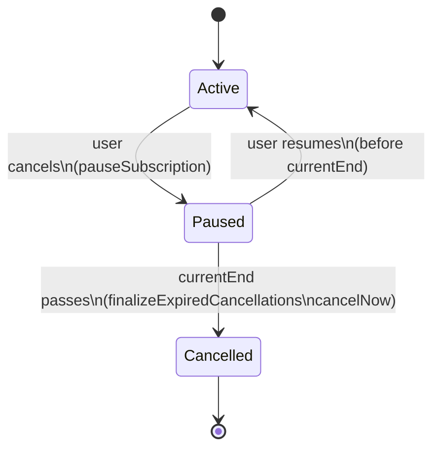
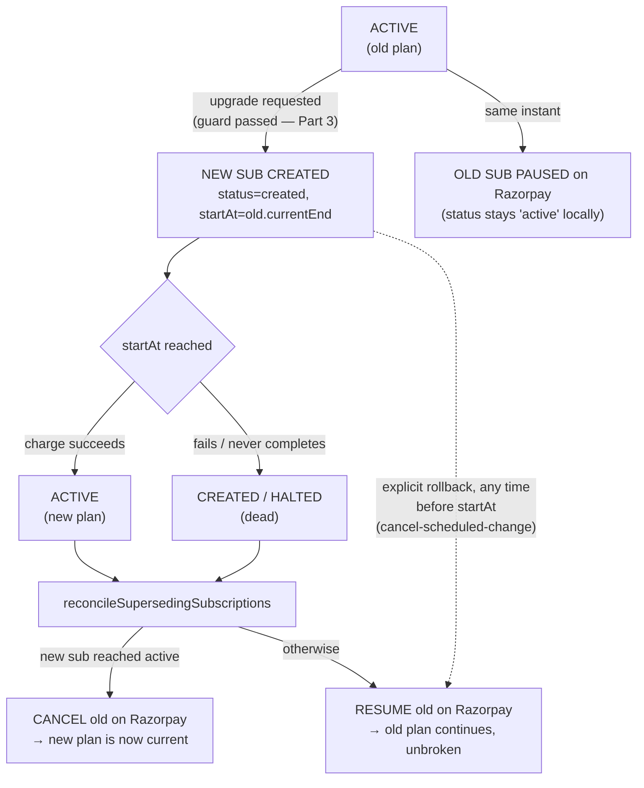
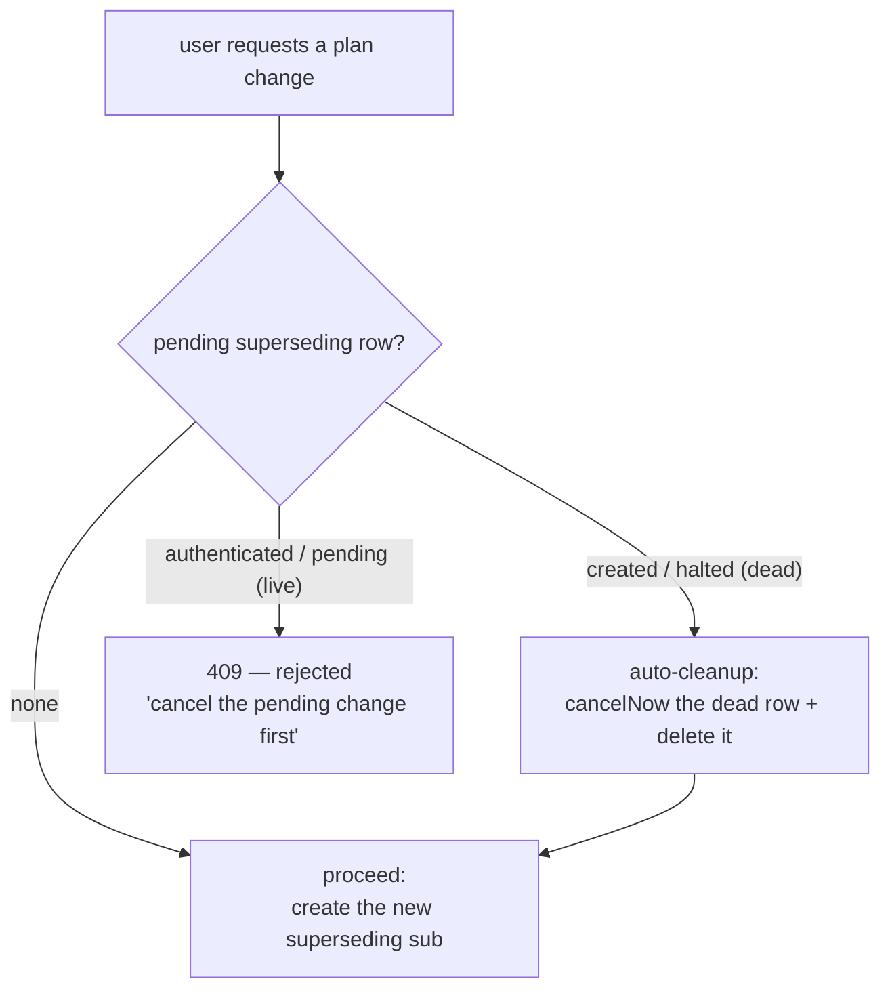
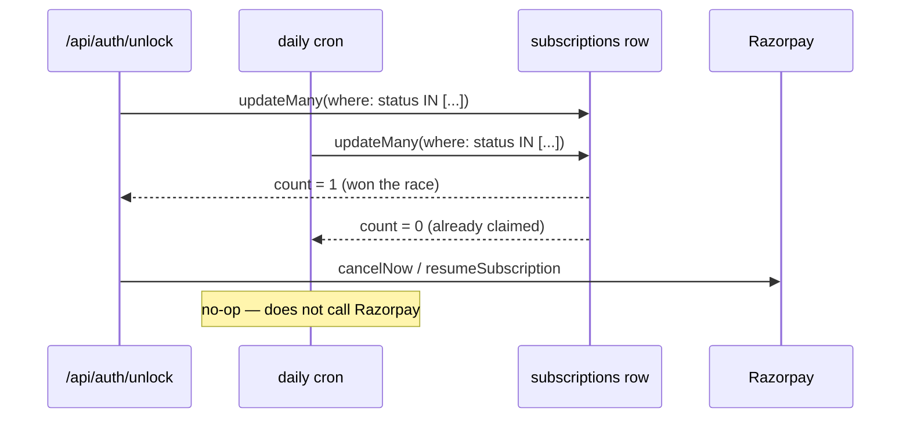

# Subscription Reconciliation: Cancel, Upgrade, and the Double-Charge Guard

> Source of truth: `frontend/src/lib/services/SubscriptionService.ts`,
> `frontend/src/app/api/subscription/change-plan/route.ts`,
> `frontend/src/app/api/subscription/cancel-scheduled-change/route.ts`,
> `frontend/src/app/api/auth/unlock/route.ts`,
> `frontend/src/app/api/cron/finalize-cancellations/route.ts`.
> This document explains the *design* behind those files — read the files themselves
> for exact current behavior if they've since diverged from what's described here.

## Why this exists

Razorpay subscriptions bill on a fixed recurring schedule with no built-in concept of
"switch plans mid-cycle." Cancelling a subscription and switching plans both have to be
built on top of Razorpay's primitives (`cancel`, `pause`, `resume`, `create`), and every
one of those operations has a window where, if handled naively, a customer's old plan
and new plan can both bill for the same period. This document describes how WealthVault
avoids that — for both cancellation and plan upgrades — and the reconciliation system
that ties it together.

**The one invariant everything below serves:** a customer is never billed twice for
overlapping periods, whether they cancel, upgrade, roll back an upgrade, or do nothing
at all and let a pending change resolve on its own.

---

## Part 1 — Cancel: pause now, resolve later

A user cancelling a paid plan does **not** call Razorpay's `cancel` API immediately.

`POST /api/subscription/cancel` instead:
1. Calls `provider.pauseSubscription(...)` — reversible, stops Razorpay from billing the
   next cycle, but the subscription still exists and can resume.
2. Sets `cancelAtCycleEnd: true` on the local row.

The user keeps full access through `currentEnd` (the cycle they already paid for) — see
`grants()` in `SubscriptionService.ts`, which checks `cancelAtCycleEnd` and grants access
only while `now < currentEnd`.

**Reversal:** `POST /api/subscription/resume` calls `provider.resumeSubscription(...)` and
flips `cancelAtCycleEnd` back to `false`, as long as `currentEnd` hasn't passed yet. Once
it has, resume returns 409 ("subscription has ended — subscribe again") — the grace
window is over.

**Finalizing the cancellation:** once `currentEnd` actually passes, `finalizeExpiredCancellations()`
(`SubscriptionService.ts`) calls `provider.cancelNow(...)` to fully terminate the
Razorpay-side object and marks the row `status: "cancelled"`. This runs from two places
— see **Part 4**.



---

## Part 2 — Upgrade: pause the old plan immediately, fork at `startAt`

### The bug this fixes

The naive version of a plan change: create a new Razorpay subscription for the new plan,
scheduled to start when the old plan's current cycle ends (`startAt = old.currentEnd`).
Leave the old subscription running until then, then cancel it once the new one's webhook
reports `active`.

The problem: **both** subscriptions have their next billing event on the exact same day
(`old.currentEnd`). The old subscription's own auto-renewal and the new subscription's
first charge are racing. If the old subscription's renewal fires before the reactive
cancel gets around to stopping it (webhook delivery is not instant, and depends on
Razorpay's delivery + this app's processing), the customer is charged for both plans on
the same day.

### The fix: pause proactively, not react

`POST /api/subscription/change-plan` (`frontend/src/app/api/subscription/change-plan/route.ts`):

1. Resolves the user's actual current, access-granting subscription — via
   `getGrantingSubscription(userId)`, **not** a naive "most recent row with an
   active-ish status" query (see the sidebar below on why that distinction matters).
2. Guards against a second upgrade already in flight (see **Part 3**).
3. Creates the new Razorpay subscription with `startAt = cur.currentEnd`, and a local row:
   `status: "created"`, `supersedesId: cur.id`, `startAt: cur.currentEnd`.
4. **Immediately** calls `provider.pauseSubscription(cur.providerSubscriptionId)` on the
   *old* subscription — before checkout even opens, not after the new plan activates.

Because the old subscription is paused the moment the upgrade is requested, it can never
auto-renew into the same billing day the new subscription's first charge lands on. There
is no window where both are live.

### Why `getGrantingSubscription`, not a naive query

The original `change-plan` implementation selected "current" with:

```ts
prisma.subscription.findFirst({
  where: { userId, status: { in: ["active", "authenticated", "pending"] } },
  orderBy: { createdAt: "desc" },
})
```

This can accidentally select a **pending superseding row** as "current" — a row with
`status: "authenticated"` that hasn't started yet (`startAt` still in the future) matches
that filter and, being newer, wins the `orderBy`. `getGrantingSubscription` instead reuses
the same `grants()` logic `getEffectivePlan` uses, which explicitly excludes a row whose
`startAt` hasn't arrived yet. This bug surfaced while adding the one-in-flight guard
(Part 3) — a live pending change was resolving `cur` to *itself*, so a second upgrade
attempt appeared to have no current subscription to guard against.

### The fork at `startAt`

Once the new row's `startAt` arrives, exactly one of two things has happened on
Razorpay's side, and `reconcileSupersedingSubscriptions` (Part 4) resolves whichever it was:

- **Success** (`status: "active"`) — the mandate authenticated and the first charge went
  through. The old plan is cancelled for good.
- **Failure** — the new subscription never reached `active` by `startAt`. Two ways this
  happens, treated identically:
  - Checkout was abandoned — the row is stuck at `status: "created"`, no mandate was
    ever set up.
  - The mandate *was* authenticated, but the actual charge failed (expired/blocked card)
    and Razorpay exhausted its retries — the row reaches `status: "halted"`.

  Either way: the old plan is **resumed** (undoing the pause from step 4 above), and the
  dead new-plan row is cancelled on Razorpay and marked terminal locally. The customer
  ends up exactly where they started — no gap in access, no stray charge.

A row still `authenticated` or `pending` *past* its `startAt` is deliberately left alone
— Razorpay may still be retrying the charge, and guessing "failed" prematurely risks
telling the customer their upgrade failed right before it actually succeeds.



### Explicit rollback

A user can also back out of a pending upgrade by hand, any time before `startAt`:
`POST /api/subscription/cancel-scheduled-change`
(`frontend/src/app/api/subscription/cancel-scheduled-change/route.ts`):

1. Finds the pending superseding row (`supersedesId` set, status `created`/`authenticated`,
   `startAt` still in the future).
2. Calls `provider.cancelNow(...)` on it and deletes the local row.
3. Looks up the superseded (old) row via `pending.supersedesId` and, if it hasn't ended,
   calls `provider.resumeSubscription(...)` — undoing the pause from step 4 above, so the
   old plan keeps renewing exactly as if the upgrade was never requested.

Step 3 is easy to miss: before this was added, the old subscription would stay paused
forever after an explicit rollback, since nothing else ever resumes a row that was paused
but whose superseding attempt was cancelled by hand rather than left to fail on its own.

---

## Part 3 — One *live* upgrade in flight, never two

`change-plan` guards against a customer stacking a second upgrade attempt on top of a
first — which would otherwise leave two superseding rows both racing toward their own
`startAt` against the same old plan.

The guard has three outcomes, keyed off the existing pending row's Razorpay status —
**not** off `endedAt` (see the callout in Part 5 on why):

| Pending row status | Meaning | Outcome |
|---|---|---|
| `authenticated` / `pending` | A live mandate that might still resolve on a later Razorpay retry | **Hard 409** — "a plan change is already in progress — cancel it before starting another" |
| `created` / `halted` | Dead — never got a mandate, or Razorpay gave up | **Auto-retired**: `cancelNow` the orphaned Razorpay sub, delete the local row, then proceed with the new request |

This distinction is also what makes the existing **"Retry payment"** UI button (shown
when a superseding row is stuck at `created` or `halted` — see Part 5) work correctly: a
retry against a dead attempt cleans it up and proceeds, rather than either creating a
second stray row or bouncing off a 409 that was never meant for it. Because the check
lives inside the route itself — not just the UI's disabled-button state — a direct API
call gets the identical guarantee a click through the UI would.



---

## Part 4 — Two triggers, one function, one atomic claim

`reconcileSupersedingSubscriptions(opts?: { userId?: string })`
(`SubscriptionService.ts`) is the single place that resolves the fork described in Part 2.
It's called from exactly two places:

- **`POST /api/auth/unlock`** — scoped to `userId`, called synchronously right after the
  session is established and *before* the response is returned. This means a user who
  logs in after their `startAt` has passed always sees fully resolved subscription state
  on their very next page load — no stale "upcoming" or "payment failed" card lingering
  because they happened to log in a moment after resolution should have occurred.
- **The daily cron** (`GET /api/cron/finalize-cancellations`, scheduled via
  `frontend/vercel.json`) — called with no `userId`, sweeping every user's due rows. This
  is what resolves a pending change for a user who never logs back in.

### Why the atomic claim matters

Both triggers can reach the same overdue row within the same second — a user logging in
at exactly midnight while the cron also fires. If both tried to act on the row, Razorpay
could get two `cancelNow`/`resumeSubscription` calls for the same subscription.

The fix: before acting on a row, each branch claims it with a conditional
`updateMany({ where: { id, status: { in: [...] } }, data: { status: "cancelled", ... } })`.
Only the caller whose `updateMany` actually changes a row (`count === 1`) proceeds to call
Razorpay; the other sees `count === 0` and does nothing. This has been verified with a
real concurrency test — two `reconcileSupersedingSubscriptions()` calls fired via
`Promise.all` against the same row, asserting exactly one of them reports having acted
(`tests/api/subscription/effective-plan.test.ts`, `"two concurrent reconciliation passes
never both act on the same row"`).



---

## Part 5 — A gotcha that broke three things the same way

`applySubscriptionEvent` (the Razorpay webhook handler) sets `endedAt: new Date()` on a
subscription row the instant a **terminal** webhook (`halted`, `completed`, `expired`)
arrives — this happens unconditionally, before reconciliation ever runs, and regardless
of whether the row is a superseding (plan-change) row or an ordinary one.

Three separate pieces of logic were using `endedAt: null` as their "still pending /
not yet resolved" signal, and all three silently broke the moment a superseding row
reached `halted` via a real webhook, because the webhook handler had already set
`endedAt` before any of them got a chance to look at the row:

1. **`reconcileSupersedingSubscriptions`'s `due` query** — filtered on `endedAt: null`,
   so an already-halted row was invisible to the rollback branch entirely. The old plan
   was never resumed.
2. **`buildManageView`'s `failedChange` detection** — same filter, so the "your last
   attempt to switch plans didn't go through — retry?" card never appeared for a halted
   attempt (it did work for the `created`/abandoned-checkout case, which never gets
   `endedAt` set by anything).
3. **`change-plan`'s one-in-flight guard** (Part 3) — same filter meant a halted pending
   row wasn't found at all, so clicking "Retry payment" created a second, redundant
   superseding row instead of cleaning up the dead one first.

**The fix, applied in all three places:** switch from `endedAt: null` to an explicit
status-based check (`status: { in: [...] }`, or checking `row.status` directly). A
terminal webhook's side effect on `endedAt` can no longer hide a row from logic that
should still see it — the row leaves each of these sets only when *that specific logic*
resolves it (setting `status: "cancelled"`), not whenever some unrelated webhook happens
to touch `endedAt` first.

**This was only caught by testing through the real webhook path** — every existing unit
test that constructed a `halted` row directly via the test factory (skipping
`applySubscriptionEvent` entirely) passed, because those fixtures never had `endedAt` set
in the first place. The regression tests added for this fire a real signed webhook
through `applySubscriptionEvent` before asserting reconciliation/UI/guard behavior, so
this exact class of bug can't silently regress again.

---

## Part 6 — What the customer actually sees

| State | UI (subscription page) |
|---|---|
| Pending row `authenticated`/`pending`, `startAt` ahead | **Scheduled-change card**: "Switching to Treasury on Oct 5" · other tiers disabled |
| Pending row `created` (checkout abandoned) | **Failed-change card**: "Your last attempt to switch to Treasury didn't go through. You can try again." + Retry button |
| Pending row `authenticated`/`pending`, `startAt` passed | **Nothing — steady state.** Deliberately silent: Razorpay hasn't given up yet |
| Pending row `halted` (Razorpay gave up) | **Same failed-change card** as the abandoned-checkout case |
| Reconciliation has resolved it (either outcome) | **Nothing pending** — just the resulting plan, shown plainly |

---

## Verification

- **Unit/integration** (`tests/api/subscription/*.test.ts`): every branch above —
  cancel/resume, upgrade success, upgrade rollback (both `created` and `halted`),
  the one-in-flight guard (all three outcomes), the atomic claim under real concurrency,
  and the three `endedAt`-vs-webhook regressions — has dedicated Jest coverage against a
  real Postgres test database (`FakeProvider` standing in for Razorpay).
- **Live**: the full cancel flow, the full upgrade flow (success and rollback), and the
  failed-change UI card were exercised end-to-end against the running dev server — real
  checkout stub, real signed webhooks, real cron endpoint call — not just Jest.

See `frontend/scripts/wipe-database.ts` (`npm run db:reset-test`, or `npm run db:wipe --
--env=testing|production|both` for a specific target) for a script that cancels every
non-terminal Razorpay subscription for the target database(s) and wipes all
user/subscription data except reference tables (`subscription_plans`, `auth_platforms`)
— useful for repeatedly re-running the manual walkthroughs above against a clean slate.
