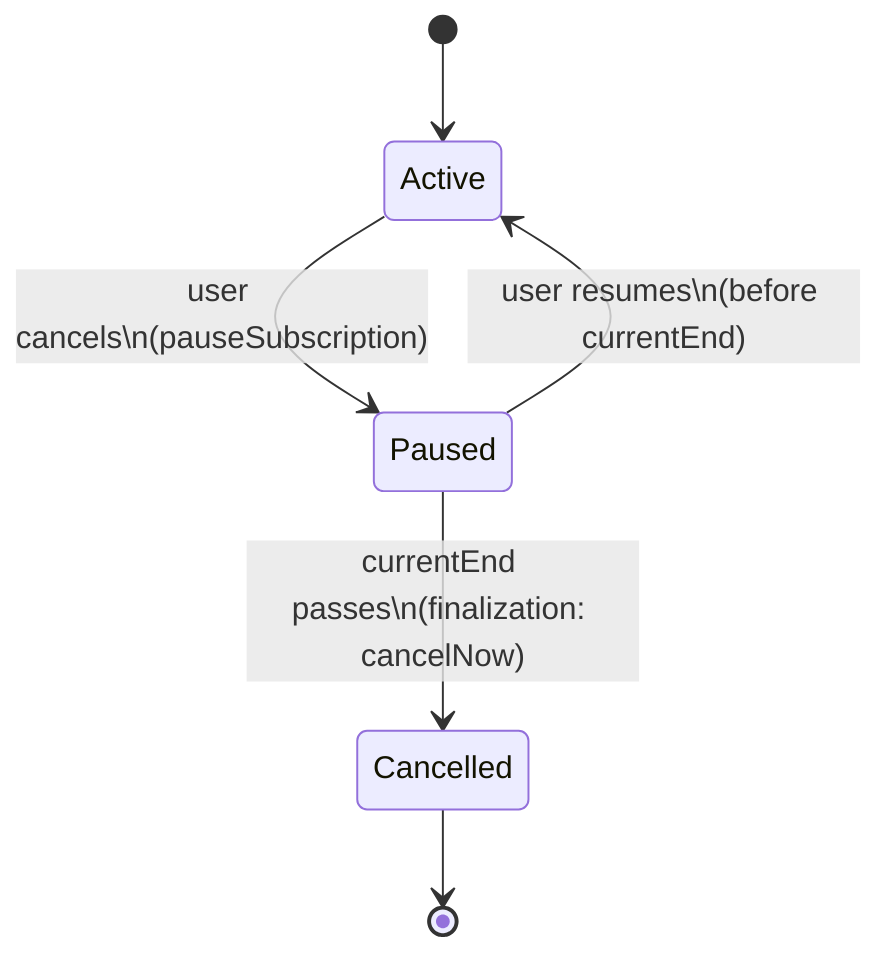
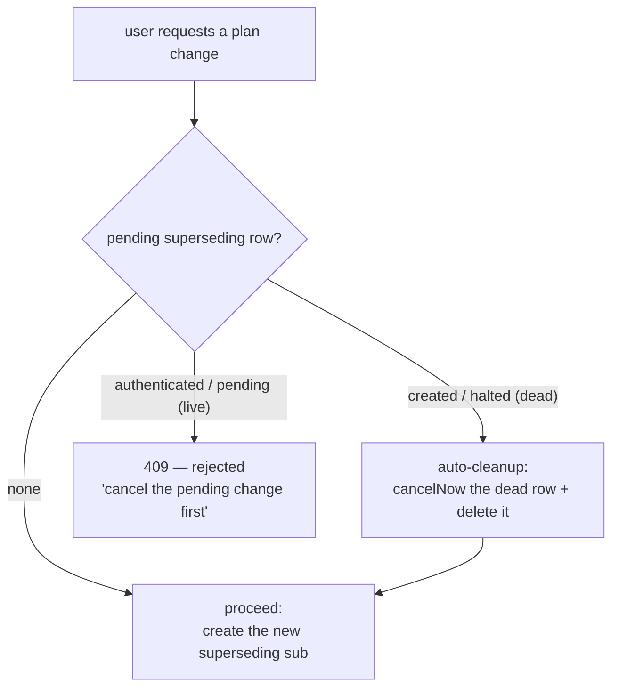
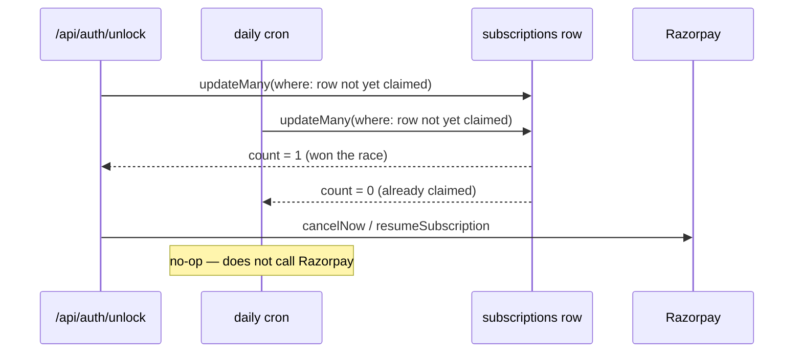

# Subscription Reconciliation: Cancel, Upgrade, and the Double-Charge Guard

> Source of truth: `frontend/src/lib/services/SubscriptionService.ts`,
> `frontend/src/lib/payments/*`,
> `frontend/src/app/api/subscription/*/route.ts`,
> `frontend/src/app/api/auth/unlock/route.ts`,
> `frontend/src/app/api/cron/finalize-cancellations/route.ts`,
> `frontend/vercel.json`.
> This document explains the *design* behind those files — read the files themselves
> for exact behavior.

## Why this exists

Razorpay subscriptions bill on a fixed recurring schedule with no built-in concept of
"switch plans mid-cycle." Cancelling a subscription and switching plans both have to be
built on top of Razorpay's primitives (`cancel`, `pause`, `resume`, `create`), and every
one of those operations has a window where, if handled naively, a customer's old plan
and new plan can both bill for the same period. This document describes how WealthVault
avoids that — for both cancellation and plan changes — and the reconciliation system
that ties it together.

**The one invariant everything below serves:** a customer is never billed twice for
overlapping periods, whether they cancel, change plans, roll back a plan change, or do
nothing at all and let a pending change resolve on its own.

---

## Access rules — what "current plan" means

`getEffectivePlan(userId)` (`SubscriptionService.ts`) computes the plan a user is entitled
to from all of their `subscriptions` rows. A row grants access according to `grants()`:

| Row state | Grants access? |
|---|---|
| `startAt` is in the future (scheduled plan-change row) | No |
| `cancelAtCycleEnd: true` | Only while `now < currentEnd` |
| `status` is `active`, `authenticated`, or `pending` | Yes, unconditionally |
| `status` is `cancelled` or `completed` | Only while `now < currentEnd` |
| any other status (`created`, `paused`, `halted`, `expired`) | No |

When several rows grant, the one whose access extends furthest wins (a row that grants
unconditionally with no `currentEnd` outranks any finite one). With no granting row the
user is on `FREE`. `paymentRetrying` is `true` when any granting row has `status:
"pending"` (Razorpay is retrying a failed charge).

Each call also:
- finalizes any expired cancel-at-cycle-end rows first (Part 1);
- keeps `User.subscriptionPlanId` equal to the effective plan, updating it and logging a
  `subscription_plan_history` row whenever it differs.

`getGrantingSubscription(userId)` applies the same selection and returns the winning row.
`GET /api/auth/me`, `GET /api/subscription`, `POST /api/subscription/create`, and every
webhook evaluate `getEffectivePlan`.

---

## Part 1 — Cancel: pause now, resolve later

A user cancelling a paid plan does **not** call Razorpay's `cancel` API immediately.

`POST /api/subscription/cancel` instead:
1. Finds the user's most recent row with status `active`, `authenticated`, or `pending`
   (404 if none).
2. Calls `provider.pauseSubscription(...)` — reversible, stops Razorpay from billing the
   next cycle, but the subscription still exists and can resume.
3. Sets `cancelAtCycleEnd: true` on the local row and returns `{ ok: true, accessUntil }`.

The user keeps full access through `currentEnd` (the cycle they already paid for) — see
`grants()` in `SubscriptionService.ts`, which checks `cancelAtCycleEnd` and grants access
only while `now < currentEnd`.

**Reversal:** `POST /api/subscription/resume` finds the user's most recent row with
`cancelAtCycleEnd: true` and status `active`, `authenticated`, `pending`, or `paused`
(404 if none), and — as long as `currentEnd` hasn't passed — calls
`provider.resumeSubscription(...)`, sets `cancelAtCycleEnd` back to `false`, and moves a
`paused` row to `active` immediately. Once `currentEnd` has passed (or is missing), resume
returns 409 ("subscription has ended — subscribe again") — the grace window is over.

**Finalizing the cancellation:** once `currentEnd` passes, the row is finalized —
`provider.cancelNow(...)` fully terminates the Razorpay-side object and the row is marked
`status: "cancelled"` with `endedAt` set. If the provider call fails, the row is left
exactly as it is, so the next evaluation retries it. Finalization runs from two places:
- `getEffectivePlan` finalizes the user's own expired rows whenever it is evaluated;
- `finalizeExpiredCancellations()` sweeps every user's expired rows and then re-evaluates
  each affected user's effective plan (called by the daily cron — see **Part 4**).

**Unexpected renewal:** if Razorpay charges a cycle anyway on a row that still has
`cancelAtCycleEnd: true` (a `subscription.charged` webhook), `applySubscriptionEvent` calls
`provider.cancelNow(...)` and marks the row `cancelled` with `endedAt` set, keeping
`currentEnd` at the pre-charge value so access still ends at the cycle the user last
paid for. If the provider call fails, the row keeps the charge's values with
`cancelAtCycleEnd` still `true`, and finalization retries once the (later) `currentEnd`
passes.

---

## Part 2 — Plan change: pause the old plan immediately, fork at `startAt`

### Why the old plan is paused up front

A plan change creates a new Razorpay subscription for the new plan, scheduled to start
when the old plan's current cycle ends (`startAt = old.currentEnd`). **Both**
subscriptions therefore have their next billing event on the exact same day
(`old.currentEnd`): the old subscription's own auto-renewal and the new subscription's
first charge. If the old subscription's renewal fired before anything stopped it (webhook
delivery is not instant, and depends on Razorpay's delivery plus this app's processing),
the customer would be charged for both plans on the same day.

WealthVault pauses the old subscription proactively, at request time, instead of reacting
to the new one's activation.

### `POST /api/subscription/change-plan`

`frontend/src/app/api/subscription/change-plan/route.ts`:

1. Validates `tier` is one of `MONTHLY`, `QUARTERLY`, `ANNUAL` (400 otherwise).
2. Resolves the user's current, access-granting subscription via
   `getGrantingSubscription(userId)` — 404 if there is none, 400 if it is already on the
   requested tier, 409 if it has no `currentEnd` yet.
3. Guards against a plan change already in flight (see **Part 3**).
4. Ensures the Razorpay customer exists, then creates the new Razorpay subscription with
   `startAt = cur.currentEnd`, plus a local row: `status: "created"`,
   `supersedesId: cur.id`, `startAt: cur.currentEnd`.
5. **Immediately** calls `provider.pauseSubscription(cur.providerSubscriptionId)` on the
   *old* subscription — before checkout even opens, not after the new plan activates.
6. Returns the Razorpay checkout parameters for the new subscription.

Because the old subscription is paused the moment the change is requested, it can never
auto-renew into the same billing day the new subscription's first charge lands on. There
is no window where both are live.

### Selecting the current subscription

`getGrantingSubscription` uses the same `grants()` logic as `getEffectivePlan`, which
excludes a row whose `startAt` hasn't arrived yet. A pending superseding row (for example
`status: "authenticated"` with `startAt` still in the future) is therefore never treated as
the user's current subscription, even though it is the newest row. That is what lets the
one-in-flight guard (Part 3) find the current subscription while a change is pending.

### The fork at `startAt`

Once the new row's `startAt` arrives, exactly one of two things has happened on
Razorpay's side, and `reconcileSupersedingSubscriptions` (Part 4) resolves whichever it was:

- **Success** (`status: "active"`) — the mandate authenticated and the first charge went
  through. The old plan is cancelled for good.
- **Failure** — the new subscription never reached `active` by `startAt`. Two ways this
  happens, treated identically:
  - Checkout was abandoned — the row is stuck at `status: "created"`, no mandate was
    ever set up.
  - The mandate *was* authenticated, but the actual charge failed (expired/blocked card)
    and Razorpay exhausted its retries — the row reaches `status: "halted"`.

  Either way: the old plan is **resumed** (undoing the pause from step 5 above), and the
  dead new-plan row is cancelled on Razorpay and marked `cancelled` locally. The customer
  ends up exactly where they started — no gap in access, no stray charge.

A row still `authenticated` or `pending` *past* its `startAt` is deliberately left alone
— Razorpay may still be retrying the charge, and guessing "failed" prematurely risks
telling the customer their change failed right before it actually succeeds.

### Explicit rollback

A user can back out of a pending plan change by hand, any time before `startAt`:
`POST /api/subscription/cancel-scheduled-change`
(`frontend/src/app/api/subscription/cancel-scheduled-change/route.ts`):

1. Finds the user's newest pending superseding row (`supersedesId` set, status `created`
   or `authenticated`, `startAt` still in the future); 404 if none.
2. Looks up the superseded (old) row via `pending.supersedesId`.
3. Calls `provider.cancelNow(...)` on the pending row.
4. If the old row exists and hasn't ended, calls `provider.resumeSubscription(...)` —
   undoing the pause from step 5 above, so the old plan keeps renewing exactly as if the
   change was never requested. Nothing else resumes an old row whose superseding attempt
   is cancelled by hand.
5. Deletes the pending local row.

### Abandoned checkout

When the user dismisses the Razorpay checkout without paying, the client calls
`POST /api/subscription/abandon` with the `providerSubscriptionId`, which runs
`abandonCreatedSubscription` (`SubscriptionService.ts`):

1. Claims the row atomically: `updateMany` scoped to the caller's `userId`, that
   `providerSubscriptionId`, and `status: "created"`, setting `status: "cancelled"` and
   `endedAt`. If it doesn't change exactly one row (another user's row, a row already past
   `created`, no such row) the call is a silent no-op returning `{ cancelled: false }`.
2. Calls `provider.cancelNow(...)` on it (a failure is logged and does not fail the call).
3. If the row was superseding another, resumes that old subscription when it hasn't
   ended — so an abandoned plan change never leaves the old plan paused.

### First-time checkouts

`POST /api/subscription/create` (only for users whose effective plan is `FREE`; 409
`already_subscribed` otherwise) creates a local `created` row with no `supersedesId`. A
retry for the **same** plan reuses that row's Razorpay subscription instead of creating a
duplicate; a **different** plan gets its own row. When one of these first-time rows starts
granting access (`authenticated`, `active`, or `pending`), `applySubscriptionEvent` cancels
the user's other `created` first-time rows through `abandonCreatedSubscription`.
`POST /api/subscription/verify` checks the Razorpay checkout signature and moves a
`created` row to `authenticated`; a row already past `created` is left as is.

---

## Part 3 — One *live* plan change in flight, never two

`change-plan` guards against a customer stacking a second change on top of a first —
which would otherwise leave two superseding rows both racing toward their own `startAt`
against the same old plan.

The guard looks for the newest row with `supersedesId = cur.id` and status `created`,
`authenticated`, `pending`, or `halted`, and keys off that Razorpay status — **not** off
`endedAt` (see Part 5):

| Pending row status | Meaning | Outcome |
|---|---|---|
| none | No change in flight | Proceed to create the new superseding subscription |
| `authenticated` / `pending` | A live mandate that might still resolve on a later Razorpay retry | **Hard 409** — "a plan change is already in progress — cancel it before starting another" |
| `created` / `halted` | Dead — never got a mandate, or Razorpay gave up | **Auto-retired**: `cancelNow` the orphaned Razorpay sub (a failure is logged and ignored), delete the local row, then proceed with the request |

This distinction is also what makes the **Retry** button on the failed-change card (shown
when a superseding row is stuck at `created` or `halted` — see Part 6) work correctly: a
retry against a dead attempt cleans it up and proceeds, rather than either creating a
second stray row or bouncing off a 409 that was never meant for it. Because the check
lives inside the route itself — not just the UI's disabled-button state — a direct API
call gets the identical guarantee a click through the UI would.

---

## Part 4 — Two triggers, one function, atomic claims

`reconcileSupersedingSubscriptions(opts?: { userId?: string })`
(`SubscriptionService.ts`) is the single place that resolves the fork described in Part 2.
It selects every row with `supersedesId` set, `startAt <= now`, and status `active`,
`created`, `authenticated`, `pending`, or `halted` (scoped to `userId` when given), then:

- **`active`** — retires the old plan: claims the superseded row (only if it hasn't
  ended), calls `provider.cancelNow(...)` on it, counts an `upgraded`.
- **`created` / `halted`** — rolls back: claims the dead row, calls `provider.cancelNow(...)`
  on it, resumes the superseded row if it hasn't ended, counts a `rolledBack`.
- **`authenticated` / `pending`** — skipped; Razorpay may still resolve it.

Provider failures are logged and do not abort the pass. Afterwards `getEffectivePlan` is
re-evaluated for every affected user.

It's called from exactly two places:

- **`POST /api/auth/unlock`** — scoped to `userId`, called synchronously after the
  session is established and *before* the response is returned. A user who logs in after
  their `startAt` has passed therefore always sees fully resolved subscription state on
  their very next page load — no stale "upcoming" or "payment failed" card lingering.
- **The daily cron** (`GET /api/cron/finalize-cancellations`, scheduled in
  `frontend/vercel.json` as `30 18 * * *`, daily at 18:30 UTC) — called with no `userId`,
  sweeping every user's due rows, in parallel with `finalizeExpiredCancellations()`. This
  is what resolves a pending change for a user who never logs back in. When `CRON_SECRET`
  is set, the route requires `Authorization: Bearer $CRON_SECRET` and returns 401
  otherwise. It responds with `{ finalized, upgraded, rolledBack }`.

### Why the atomic claim matters

Both triggers can reach the same overdue row within the same second — a user logging in
at exactly the cron's run time. If both tried to act on the row, Razorpay could get two
`cancelNow`/`resumeSubscription` calls for the same subscription.

Before acting on a row, each branch claims it with a conditional `updateMany` that sets
`status: "cancelled"` and `endedAt`:

- retiring the **superseded (old) row** on success claims with `where: { id, endedAt: null }`;
- rolling back a **dead superseding row** claims with
  `where: { id, status: { in: ["created", "halted"] } }` — by status, because a `halted`
  row already has `endedAt` set by its webhook.

Only the caller whose `updateMany` actually changes a row (`count === 1`) proceeds to call
Razorpay; the other sees `count === 0` and does nothing. Two `reconcileSupersedingSubscriptions()`
calls fired via `Promise.all` against the same row therefore report exactly one action
(`tests/api/subscription/effective-plan.test.ts`, `"two concurrent reconciliation passes
never both act on the same row"`).

---

## Part 5 — Webhooks, and why status (not `endedAt`) drives resolution

`POST /api/subscription/webhook/razorpay` verifies the `x-razorpay-signature` header
(400 on a bad or missing signature), records the event in `processed_webhook_events`
(unique on `provider` + `eventId`), and runs `applySubscriptionEvent`. A duplicate event is
skipped only if its earlier attempt finished (`status: "done"`); a row stuck at
`"processing"` from a crashed attempt is reprocessed, which is safe because every write
uses absolute values from the payload, never deltas. The row is set to `"done"` after
processing succeeds.

Razorpay events map to a normalized `kind`; any other event is `ignored`:

| Razorpay event | `kind` |
|---|---|
| `subscription.authenticated` | `authenticated` |
| `subscription.activated` | `activated` |
| `subscription.charged` | `charged` |
| `subscription.pending` | `pending` |
| `subscription.halted` | `halted` |
| `subscription.paused` | `paused` |
| `subscription.resumed` | `resumed` |
| `subscription.cancelled` | `cancelled` |
| `subscription.completed` | `completed` |
| `subscription.updated` | `updated` |

`applySubscriptionEvent`:
- writes `status`, `paidCount`, `currentStart`, `currentEnd`, `chargeAt`, and
  `cancelAtCycleEnd` from the payload — `currentStart`/`currentEnd`/`chargeAt` are
  authoritative on every event and may legitimately be `null`. `cancelAtCycleEnd` is set
  to `true` for a `cancelled` event that still has a `current_end`, `false` for `resumed`,
  and otherwise left unchanged;
- sets `endedAt` to the current time on the instant a **terminal** status (`halted`,
  `completed`, `expired`) arrives — unconditionally, before reconciliation ever runs, and
  regardless of whether the row is a superseding row or an ordinary one;
- ignores a non-terminal event for a row that has already reached a terminal status with
  `endedAt` set;
- cancels the user's sibling first-time `created` rows when a first-time row starts
  granting access (see Part 2);
- handles a renewal charge on a `cancelAtCycleEnd` row (see Part 1);
- does **not** retire the old plan when a superseding row goes `active` — that is
  `reconcileSupersedingSubscriptions`' job (Part 4), so cancellation happens on one
  reconciled path instead of whenever a webhook happens to arrive;
- finishes by re-evaluating `getEffectivePlan` for the user.

Because a terminal webhook sets `endedAt` before any reconciliation runs, three pieces of
logic decide "still pending / not yet resolved" by **status**, never by `endedAt: null`:

1. **`reconcileSupersedingSubscriptions`'s `due` query** — filters on
   `status: { in: [...] }`, so an already-halted row is still visible to the rollback
   branch and the old plan gets resumed.
2. **`buildManageView`'s `failedChange` detection** — matches `created` and `halted`
   rows, so the failed-change card appears for a halted attempt as well as an abandoned
   checkout.
3. **`change-plan`'s one-in-flight guard** (Part 3) — matches on status, so a halted
   pending row is found and cleaned up before a retry proceeds.

A row leaves each of these sets only when *that specific logic* resolves it (setting
`status: "cancelled"`), not whenever an unrelated webhook touches `endedAt` first.

---

## Part 6 — What the customer actually sees

`buildManageView(userId)` (returned by `GET /api/subscription`) describes the granting
subscription plus any pending change on top of it:

- a **scheduled change** is a superseding row of the granting subscription with
  `startAt` in the future and status `authenticated` or `active`;
- a **failed change** is a superseding row with status `created` or `halted`, reported
  only when there is no scheduled change.

| State | UI (subscription page) |
|---|---|
| Pending row `authenticated`/`active`, `startAt` ahead | **Scheduled-change card** showing the target plan and start date · other tiers disabled |
| Pending row `created` (checkout abandoned) | **Failed-change card**: the last attempt to switch didn't go through, with a Retry button |
| Pending row `halted` (Razorpay gave up) | **Same failed-change card** as the abandoned-checkout case |
| Pending row `authenticated`/`pending`, `startAt` passed | **Nothing — steady state.** Deliberately silent: Razorpay hasn't given up yet |
| Pending row `pending`, `startAt` ahead | **Nothing** — not yet a scheduled change or a failure |
| Granting subscription is `pending` | **Payment-retrying state** (`paymentRetrying: true`) with a retry link taken from the subscription's `providerData.shortUrl` |
| Reconciliation has resolved it (either outcome) | **Nothing pending** — just the resulting plan, shown plainly |

---

## Verification

`tests/api/subscription/*.test.ts` covers every branch above against a real Postgres test
database, with `FakeProvider` (`PAYMENTS_PROVIDER=fake`) standing in for Razorpay:
- `effective-plan.test.ts` — access rules, cancel-at-cycle-end finalization,
  `reconcileSupersedingSubscriptions` (success, rollback, `startAt` in the future, user
  scoping, global sweep, idempotency, concurrent passes), and `abandonCreatedSubscription`;
- `manage.test.ts` — cancel, resume, change-plan (including the one-in-flight guard and
  dead-row cleanup), cancel-scheduled-change, and `buildManageView`;
- `webhook.test.ts` — signature checks, idempotency, event handling, halted superseding
  rows through the real webhook path, and first-time sibling cleanup;
- `cron.test.ts` — `CRON_SECRET` handling and the global sweep;
- `create-verify.test.ts`, `abandon.test.ts`, `razorpay-provider.test.ts` — checkout
  creation and verification, the abandon route, and signature/event normalization.

## Resetting test data

`frontend/scripts/wipe-database.ts` (`npm run db:reset-test`, or `npm run db:wipe --
--env=testing|production|both --yes [--confirm-production]` for a specific target; the
repo-root `wipe.sh [testing|production|both]` wraps it and also clears `nav_config`)
attempts to cancel on Razorpay every subscription whose status is not `cancelled` —
active, paused, halted, pending, completed, and expired alike. A cancel that Razorpay
rejects (for example on an already-completed subscription) is logged and skipped. It then
deletes all users, subscriptions, plan history, webhook events, and preferences, and
preserves the reference tables (`subscription_plans`, `auth_platforms`) — useful for
re-running the manual walkthroughs above against a clean slate.
