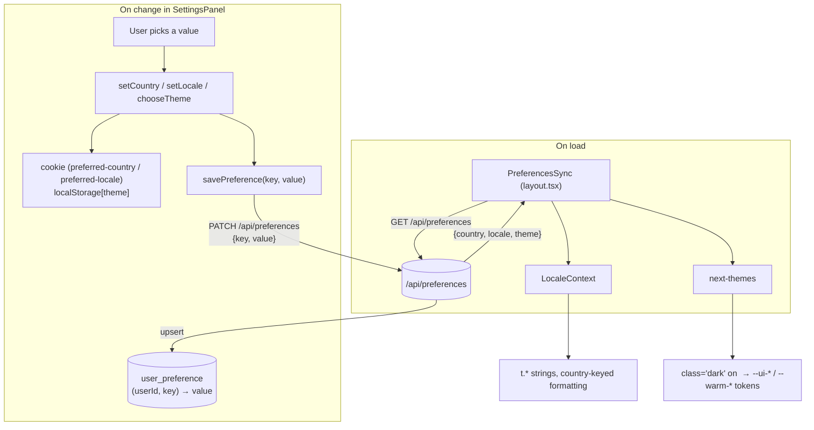

# Screen: Settings (`/settings`)

The screen reached from the sidebar's **Settings** pill. A single elevated panel with
three controls — **Country**, **Language**, **Theme** — that persist per user through
`/api/preferences` and follow the user across devices. It holds no account data and no
monetary values; its only side effects are preference writes.

---

## 1. Overview

`/settings` is a protected page. It requires an authenticated **and unlocked** session
(`session.userId` **and** `session.encryptionKey`) — a locked or signed-out visitor is
redirected to `/unlock` (see **Access & Guarding**).

The three settings are the app's complete set of user-settable preferences. Each change
is written two ways: immediately to a cookie (per-device, read on next load by
`LocaleContext` / `next-themes`) and to the `user_preference` table via
`PATCH /api/preferences` (cross-device, replayed on next load by `PreferencesSync`).

---

## 2. Entry Point — the sidebar's Settings pill

There is no separate profile menu. The sidebar has a dedicated **Settings** pill in its
bottom (account) group — a direct link, not a menu item:

```
Sidebar (bottom group, screen edge upward)
└── Log out pill
└── Identity pill      — avatar + name, tap/hover reveals only, no menu, no navigation
└── Settings pill      → <Link href="/settings">                       ← this screen
└── Subscription pill  → <Link href="/subscription">
```

Each pill is independent — there is no popover, no "Lock screen" entry point in the
sidebar at all (locking mid-session is only reachable via `Header`'s **Lock** button; see
`documents/screens/04 Sidebar Navigation.md` §9). Theme/locale/country are changed
**only** here on `/settings` — see `documents/database/user-preference.md` for the
history of what else used to change them.

---

## 3. File Map

| File | Role |
|------|------|
| `src/app/(app)/settings/page.tsx` | The route. Just `return <SettingsPanel />` — no session guard or `AppShell` wrap of its own; both live in the shared `(app)` layout (see **Access & Guarding**). |
| `src/app/(app)/settings/loading.tsx` | Suspense fallback — a skeleton mirroring the three `Row` cards, shown while the page's server data resolves. |
| `src/app/(app)/layout.tsx` | Shared layout for every `(app)` route: the `encryptionKey`/`userId` guard and the `AppShell` wrap, not written per-page. |
| `src/components/settings/SettingsPanel.tsx` | The whole screen body — the elevated panel, the three `Row` cards, all control wiring. `'use client'`. |
| `src/components/ui/Select.tsx` | The Radix-based dropdown used for Country and Language. Styled with the app's `--ui-*` tokens. |
| `src/components/layout/AppShell.tsx` | Page chrome: `Sidebar` + `Header` + scrollable `<main>` on the warm background. |
| `src/components/layout/Header.tsx` | Top bar showing the title `"Settings"` plus the shared **Refresh** and **Lock** buttons. |
| `src/components/layout/Sidebar.tsx` | The nav rail; its **Settings** pill is the only way in — no popover, no menu. See `documents/screens/04 Sidebar Navigation.md`. |
| `src/context/LocaleContext.tsx` | Holds `locale` + `country`, the `t` translation bundle, and `setLocale` / `setCountry`. Cookie-backed; IP-detects country on first visit. |
| `src/components/layout/PreferencesSync.tsx` | Rendered in `layout.tsx`. On mount, `GET /api/preferences` and pushes the result into `LocaleContext` + `next-themes`. |
| `src/lib/savePreference.ts` | `savePreference(key, value)` — fire-and-forget `PATCH /api/preferences`. |
| `src/app/api/preferences/route.ts` | `GET` (read merged prefs) + `PATCH` (upsert one pref). Documented in `documents/api/preferences-api.md` and `openapi.yaml`. |
| `src/i18n/translations.ts` | `LOCALES` (11 languages) + the `t` strings. `t.sidebar.country`/`t.sidebar.language`/`t.sidebar.lockScreen` remain defined per locale but are dead — not read by `Sidebar.tsx` or this screen. |
| `src/i18n/countries.ts` | `COUNTRIES` + `countryFlag()`. Only **India (`IN`)** is uncommented today; every other entry is present but commented out until instrumented. |
| `src/app/layout.tsx` | Wraps the app in `next-themes`' `ThemeProvider` (`attribute="class"`, `defaultTheme="system"`, `enableSystem`). |
| `prisma/schema.prisma` | `UserPreference` model → `user_preference` table. See `documents/database/user-preference.md`. |

`PATCH /api/preferences` calls `getSession()` and `prisma.userPreference.upsert` directly.

---

## 4. Access & Guarding

Two checks, both must pass:

| Layer | Check | On failure |
|---|---|---|
| `src/middleware.ts` | Protected route → needs `session.userId` **and** `session.encryptionKey` | no `userId` → `307 → /` · `userId` but locked → `307 → /unlock` |
| `src/app/(app)/layout.tsx` | `if (!session.encryptionKey \|\| !session.userId) redirect('/unlock')` — shared by every `(app)` route, not written per-page | `307 → /unlock` |

The layout-level check is a defensive repeat — in normal operation the middleware has
already redirected before the layout (and therefore this page) ever runs.

Note the asymmetry: **`/settings` needs an unlocked vault**, but the API it drives
(`/api/preferences`) only needs `userId` — the middleware whitelists `/api/preferences`
so `PreferencesSync` can run on `/unlock` too.

---

## 5. Component Hierarchy

```
(app)/layout.tsx                                  [server: session guard]
└── AppShell
    ├── Sidebar
    ├── Header  ("Settings"  ·  Refresh  ·  Lock)
    └── <main>
        └── SettingsPage (src/app/(app)/settings/page.tsx)   [server, no logic of its own]
            └── SettingsPanel                      ['use client']
                └── elevated panel  (--ui-modal-bg, --ui-modal-shadow, rounded-3xl,
                                      mx-auto, max-w 730 / lg 860 / xl 1000)
                    └── column, gap-3, p-6 sm:p-8
                        ├── Row  "Country"   hint="Sets your currency and number formatting"
                        │    └── <Select value={country} onValueChange={setCountry}>
                        │         SelectTrigger (w-full sm:w-56) · SelectValue placeholder
                        │         SelectContent → SelectItem per COUNTRIES entry (flag + name)
                        ├── Row  "Language"  hint="Language used across the app"
                        │    └── <Select value={locale} onValueChange={v => setLocale(v as Locale)}>
                        │         SelectContent → SelectItem per LOCALES entry (native name)
                        └── Row  "Theme"     hint="When you sign out, the app follows your device"
                             └── segmented  [ Dark | Light ]  — two <button>s
                                  active = mode === "dark" ? isDark : !isDark
                                  onClick → chooseTheme(mode)
```

`Row` is a local helper in `SettingsPanel.tsx`: a `--ui-subtle-bg` card that is
`flex-row` with the label/hint left and the control right on `sm+`, and stacks to
`flex-col` with a full-width control below `640px`.

---

## 6. State

`SettingsPanel` owns almost no state — the values live in context:

| Source | Value | Notes |
|---|---|---|
| `useLocale()` | `country`, `locale`, `t`, `setCountry`, `setLocale` | From `LocaleContext` |
| `useTheme()` (next-themes) | `theme`, `setTheme` | `"dark"` / `"light"` / `"system"` |
| local `mounted` | `boolean` | `useEffect(() => setMounted(true), [])` — SSR guard for theme |
| derived `isDark` | `!mounted || theme !== "light"` | drives which segmented button reads active |

`chooseTheme(next)` = `setTheme(next)` + `savePreference("theme", next)`.

---

## 7. Sub-flows

### 7.1 Load

```
Navigate to /settings
  │  middleware: userId + encryptionKey present? ── no ──► 307 /unlock
  ▼
(app)/layout.tsx re-checks → renders AppShell around SettingsPage → SettingsPanel
  │
  ▼
SettingsPanel mounts — reads country/locale from LocaleContext, theme from next-themes
  │
  ▼ (independently, from layout.tsx — runs on every authenticated page, not just here)
PreferencesSync: GET /api/preferences
  ├── 200 { country, locale, theme } → setCountry / setLocale / setTheme
  └── non-200 → ignored, context defaults stay
```

By the time the user sees the panel, `PreferencesSync` has usually resolved and the
three controls reflect the stored values.

### 7.2 Change Country

```
User picks a country in the <Select>
  │
  ▼
onValueChange(code) → LocaleContext.setCountry(code)
  ├── setCountryState(code)                     (re-render — flag + name in trigger)
  ├── writeCookie("preferred-country", code)    (per-device, 1-year)
  └── savePreference("country", code)           → PATCH /api/preferences { key:"country", value:code }
                                                   → user_preference upsert on (userId,"country")
```

Currency / number formatting elsewhere in the app keys off `country`. The sidebar also
re-fetches `/api/nav?country=<code>` on change — see `documents/api/nav-api.md`. Since
only India has `nav_config` rows today, the visible nav list doesn't change (any other
country falls back to India's rows), even though the fetch itself succeeds. Unlike the old sidebar country
picker, changing it here does **not** navigate anywhere.

### 7.3 Change Language

```
User picks a language in the <Select>
  │
  ▼
onValueChange(code) → LocaleContext.setLocale(code as Locale)
  ├── setLocaleState(code)                      (re-render — every t.* string switches)
  ├── writeCookie("preferred-locale", code)
  ├── document.documentElement.lang = code.split("-")[0]
  └── savePreference("locale", code)            → PATCH /api/preferences
```

### 7.4 Change Theme

```
User clicks Dark or Light
  │
  ▼
chooseTheme(mode)
  ├── next-themes setTheme(mode)   → toggles class="dark" on <html>, writes localStorage["theme"]
  └── savePreference("theme", mode) → PATCH /api/preferences
```

The panel has no "System" button. `"system"` is only ever set programmatically — on
**sign-out** (`Sidebar` / `unlock` handlers call `setTheme("system")` so the
signed-out app follows the OS), and it is the provider default for a visitor with no
stored theme. On next sign-in, `PreferencesSync` restores the explicit `"dark"` /
`"light"` from the DB.

---

## 8. Data flow



`/api/preferences` reads/writes only `user_preference`. Nothing is written to the
session cookie or to `users`.

---

## 9. Theme pattern

Same as the rest of the app: `next-themes`' `ThemeProvider` in `layout.tsx`
(`attribute="class"`, `defaultTheme="system"`, `enableSystem`), all colours from the
shared `--ui-*` / `--warm-*` CSS custom properties (`:root` light, `.dark` dark), applied
as inline `style` rather than Tailwind `dark:` classes.

Panel surface: `--ui-modal-bg` + `--ui-modal-shadow` + `rounded-3xl` — the same
treatment as the Subscription "Manage" screen. Row cards: `--ui-subtle-bg` +
`--ui-card-border`. The `Select` dropdown: `--ui-input-bg` / `--ui-input-border` trigger,
`--ui-modal-bg` panel, `--ui-subtle-bg` item hover, `--ui-accent-border` focus ring.

---

## 10. API routes used by this screen

| Method | Route | When | Status |
|--------|-------|------|--------|
| GET | `/api/preferences` | On mount, via `PreferencesSync` (rendered app-wide) | Working |
| PATCH | `/api/preferences` | On each Country / Language / Theme change | Working |
| GET | `/api/auth/me` | Sidebar — to render the identity pill's name/avatar/plan | Working |
| GET | `/api/nav?country=<code>` | Sidebar — re-fetched when `country` changes | Working — see `documents/api/nav-api.md` |
| POST | `/api/auth/lock` | Header's **Lock** button (not part of this screen's own controls) | Working |
| POST | `/api/auth/signout` | Sidebar's **Log out** pill (not part of this screen's own controls) | Working |

---

## 11. Known issues

- **`COUNTRIES` has only `IN` active.** Every other country is commented out in
  `src/i18n/countries.ts`, so the Country dropdown currently offers a single choice.
  Uncomment entries as each country is instrumented.
