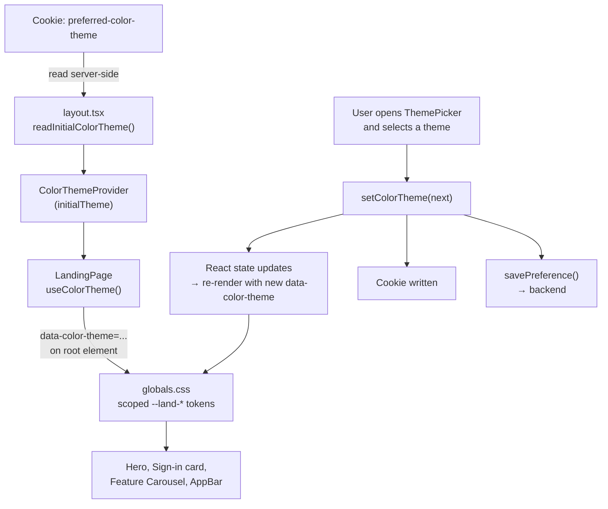
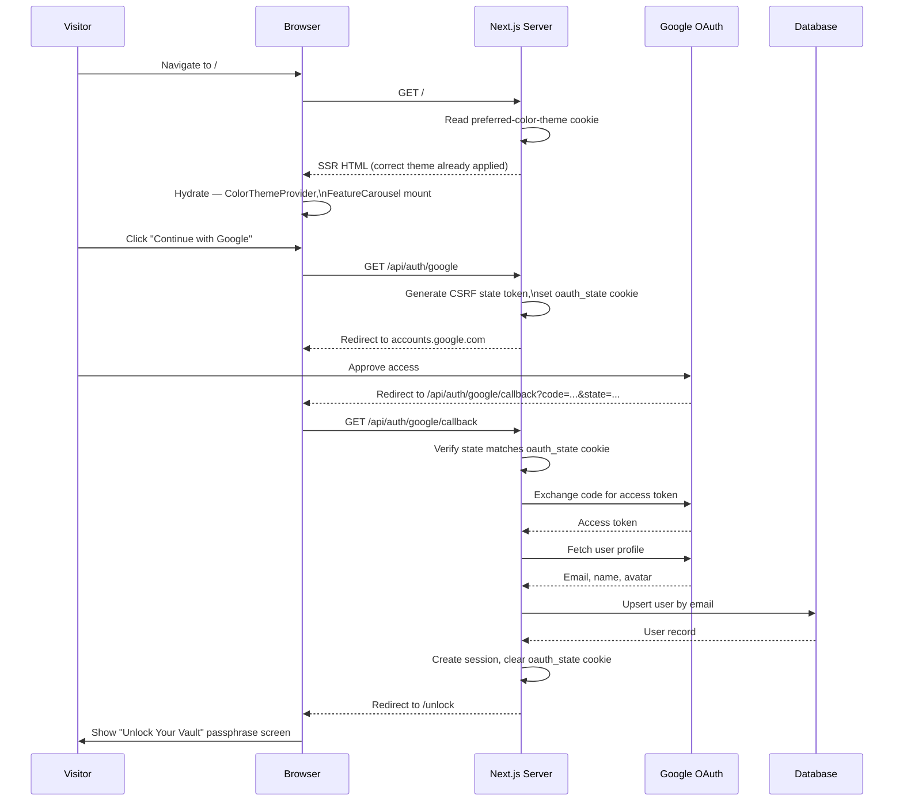

# Landing Page

## 1. Overview

The landing page (`/`) is WealthVault's unauthenticated entry point. It introduces the
product, communicates its core value (a private, unified view of a user's wealth), and
gives the visitor a single way forward: sign in. It carries no account data, no
monetary values, and makes no API calls beyond initiating OAuth — its only job is to
turn a visitor into a signed-in user.

---

## 2. File Map

| File | Role |
|------|------|
| `src/app/page.tsx` | The landing page itself — layout, copy, and the feature list. |
| `src/app/layout.tsx` | Root layout. Reads the saved color-theme cookie server-side, wraps the tree in `ColorThemeProvider`, and renders `AppBar` above every page. |
| `src/app/globals.css` | Defines the 9 color themes' CSS custom properties (`--land-*`), plus the shimmer/bob/float animations used on this page. |
| `src/components/layout/AppBar.tsx` | The fixed, glass navigation bar. Shared across the whole site; shows `ThemePicker` only on `/`. |
| `src/components/layout/ThemePicker.tsx` | The color-theme dropdown, rendered inside `AppBar` on the landing page. |
| `src/components/layout/ProfileBadge.tsx` | Account icon rendered inside `AppBar`. |
| `src/components/landing/FeatureCarousel.tsx` | The responsive feature carousel (fixed row / scroll strip / auto-advancing single card, depending on screen size). |
| `src/context/ColorThemeContext.tsx` | React context that holds the active color theme and persists changes (cookie + backend). |
| `src/lib/colorThemes.ts` | The list of valid themes and the default. |
| `src/lib/savePreference.ts` | Persists preference changes (e.g. color theme) to the backend. |
| `src/app/api/auth/google/route.ts`, `apple/route.ts`, `x/route.ts`, `linkedin/route.ts` | OAuth-initiation endpoints the sign-in buttons link to. |

---

## 3. Color Theming System

The landing page supports **9 selectable color themes**: `warm` (default), `blue`,
`violet`, `purple`, `red`, `pink`, `teal`, `green`, and `black`.

- The active theme is applied via a `data-color-theme` attribute, which scopes a set of
  CSS custom properties (`--land-bg`, `--land-blob-1/2/3`, `--land-fg` /
  `--land-fg-soft` / `--land-fg-faint`, `--land-card-bg`, `--land-card-line`,
  `--land-section-bg`, `--land-accent-a` / `--land-accent-b`, `--land-icon-bg`) that
  drive every color used on the page — background gradient, ambient orbs, card
  surfaces, text, and accents.
- Users pick a theme from the **ThemePicker** dropdown in the navigation bar. The
  choice persists across visits (saved to a cookie and to the user's preferences) and
  is read server-side on the next load, so there's no flash of the wrong theme.
- Every themed surface — the eyebrow badge, feature card icons, dot indicators, the
  page background itself — derives its color from just two values per theme
  (`--land-accent-a` and `--land-accent-b`), so adding a 10th theme only requires
  defining those tokens once.

---

## 4. Typography

The page uses a serif typeface, **Georgia** (`Georgia, 'Times New Roman', serif`), set
as the base font for all text — headlines, body copy, buttons, and the navigation bar.
The choice is modeled on WSJ's editorial typography and is intended to extend across
the site over time, not stay specific to any one page.

---

## 5. Hero Section

The hero is the first thing a visitor sees and consists of three parts:

- **Eyebrow badge** — a small pill reading "Truly One of a Kind," sitting above the
  headline. It's tinted with a gradient blended from the theme's two accent colors, has
  a glowing border (soft `box-shadow` in the accent color), a pulsing sparkle icon, and
  a light shimmer that sweeps across it on a loop.
- **Headline** — "Your Wealth. Privacy By Design. Visible Only to You." The first
  sentence is the primary text color; the second and third are each colored with one
  of the theme's two accent colors, so the emphasis words change with the theme.
- **Subheadline** — two lines summarizing the product's promise ("Your Entire WEALTH.
  One Complete VIEW. Zero COMPROMISE." / "Only you hold the PASSPHRASE. ENCRYPTED
  before it reaches us. SEEN only by you."), using selective capitalization for
  emphasis within otherwise sentence-case copy.

---

## 6. Sign-In / Authentication Options

Below the hero copy sits the "Unlock Your Vault" card — a translucent, blurred panel
with a thin gradient strip across its top (blended from the theme's two accent
colors) and four sign-in options:

| Provider | Route | Treatment |
|----------|-------|-----------|
| **Continue with Google** | `/api/auth/google` | Primary call-to-action. Full-width white pill with a subtle border, Google's official multi-color "G" mark, dark text. Sits first, above everything else. |
| **Continue with Apple** | `/api/auth/apple` | Full-width solid black pill, white Apple glyph and label. Sits directly below Google. |
| **X** | `/api/auth/x` | Half-width, near-black pill (paired side-by-side with LinkedIn below an "OR" divider). Icon only, no text label. |
| **LinkedIn** | `/api/auth/linkedin` | Half-width, LinkedIn-blue pill, paired with X. Shows the LinkedIn glyph plus the "LinkedIn" label. |

Each option is a plain link to its provider's OAuth route — no client-side logic is
involved in starting the sign-in flow.

---

## 7. Feature Carousel

The page showcases five capabilities — End-to-End Encryption, A Unified View of Your
Wealth, Global Currency Support, Real-Time Performance Tracking, and Private by
Design — each as a card with an icon, a title, and a short description. The layout
adapts to the screen it's shown on:

- **Large screens**: all five cards are shown at once in a fixed, static row (or
  wrapping to further rows if the window isn't wide enough for all five side by side).
  Nothing scrolls or auto-advances — everything is visible and readable at a glance.
- **Medium screens** (tablets, narrower windows): the cards form a horizontally
  scrollable strip. The visitor drags or swipes through them manually.
- **Small screens** (phones): one card is shown at a time, full width, and the
  carousel automatically advances to the next card every few seconds. Touching or
  tapping a position dot takes over control and pauses the auto-advance briefly before
  it resumes.

**Card design**: every card is a fixed size, so nothing changes shape based on content
length — a short description just leaves a little empty space, and a long one scrolls
within its own box rather than being cut off or stretching the card. Titles always
stay on a single line. Each card's icon panel is tinted by stepping between the
theme's two accent colors across the five cards, so the set reads as a single
gradient family rather than five unrelated colors. Each icon also gently floats up
and down on a loop and carries a soft glow in the theme's accent color — matching the
badge's glow treatment — with both effects staggered slightly per card so they don't
move in lockstep.

---

## 8. Navigation Bar & Page Background

The navigation bar is a frosted-glass panel — translucent with a background blur —
rather than a solid-color bar, so the page's gradient and ambient color show through
it. It stays fixed at the top of the screen at all times, on every page across the
site, not just the landing page.

The page background itself is the same gradient assigned to the active color theme,
applied consistently so the whole page — including the area behind the fixed
navigation bar — reads as one continuous surface rather than a page with a separate
bar stacked on top of it.

---

## 9. Data Flow Diagram

How the active color theme flows from a saved cookie down to every pixel on the page,
and back out again when the visitor changes it:

---

## 10. Sequence Diagram

The full path from a visitor loading the page to a completed Google sign-in
(verified against `src/app/api/auth/google/route.ts` and its `callback/route.ts`):

