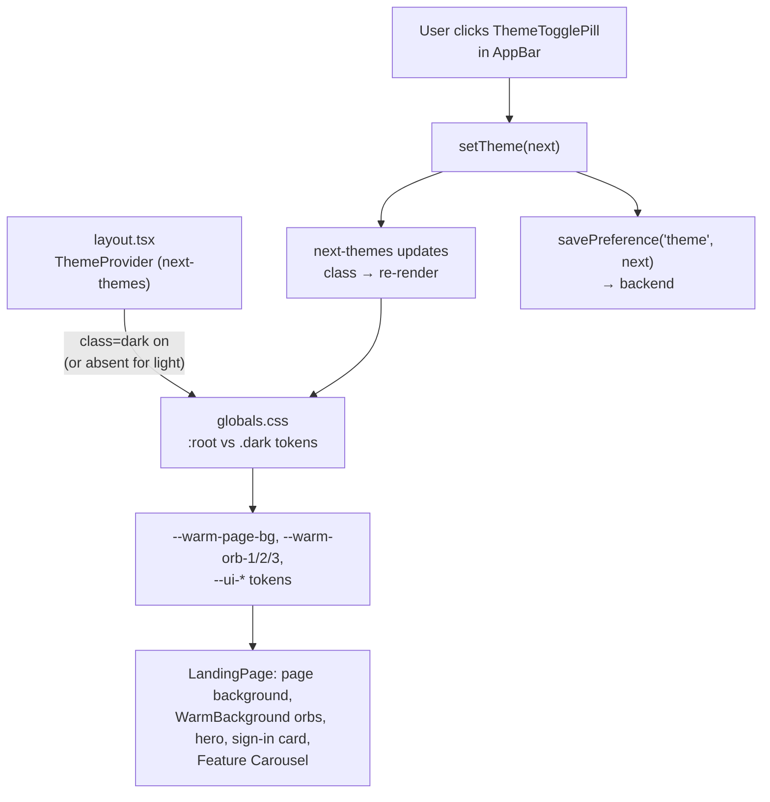
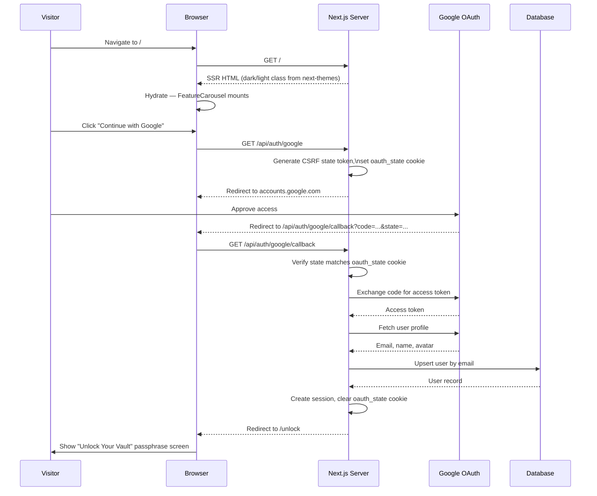

# Landing Page

## 1. Overview

The landing page (`/`) is WealthVault's unauthenticated entry point. It introduces the
product, communicates its core value (a private, unified view of a user's wealth), and
gives the visitor a single way forward: sign in. It carries no account data, no
monetary values, and makes no API calls beyond initiating OAuth — its only job is to
turn a visitor into a signed-in user.

---

## 2. File Map

| File | Role |
|------|------|
| `src/app/page.tsx` | The landing page itself — layout, copy, and the feature list. |
| `src/app/layout.tsx` | Root layout. Wraps the tree in `next-themes`' `ThemeProvider` (dark/light, `class` strategy) and renders `AppBar` above every page. |
| `src/app/globals.css` | Defines the shared `--warm-*` / `--ui-*` CSS custom properties (light mode on `:root`, dark mode on `.dark`) used by this page, `/unlock`, and the rest of the app, plus the shimmer/bob/float animations used here. |
| `src/components/layout/WarmBackground.tsx` | The three floating ambient-orb background, shared with the rest of the app (this page renders it directly). |
| `src/components/layout/AppBar.tsx` | The fixed, glass navigation bar. Shared across the whole site; shows `ThemeTogglePill` on `/` and `/unlock`. |
| `src/components/layout/ThemeTogglePill.tsx` | The dark/light switch, rendered inside `AppBar` on this page and on `/unlock`. |
| `src/components/layout/ProfileBadge.tsx` | Account icon rendered inside `AppBar`. |
| `src/components/landing/FeatureCarousel.tsx` | The responsive feature carousel (fixed row / scroll strip / auto-advancing single card, depending on screen size). |
| `src/lib/savePreference.ts` | Persists preference changes (e.g. dark/light mode) to the backend. |
| `src/app/api/auth/google/route.ts`, `apple/route.ts`, `x/route.ts`, `linkedin/route.ts` | OAuth-initiation endpoints the sign-in buttons link to. |

---

## 3. Background & Theming

As of 2026-08-26, the landing page no longer has its own color-theme system. It was
previously a **9 selectable color theme** picker (`warm`, `blue`, `violet`, `purple`,
`red`, `pink`, `teal`, `green`, `black`) scoped via a `data-color-theme` attribute and a
`ThemePicker` dropdown in the nav bar — all of that (the `ColorThemeContext`,
`colorThemes.ts`, `ThemePicker.tsx`, and the `--land-*` CSS custom properties in
`globals.css`) was removed, and the page now matches the rest of the site instead:

- **Background:** the same flat `var(--warm-page-bg)` page background and the same
  `<WarmBackground />` component (three floating ambient orbs using `--warm-orb-1/2/3`)
  used on `/unlock` and elsewhere in the app — not a page-specific gradient.
- **Mode:** plain dark/light, driven by `next-themes` (the same `ThemeProvider` wrapping
  the whole app in `layout.tsx`), not a per-page color choice. The `ThemeTogglePill` in
  the nav bar — the same component `/unlock` uses — lets a visitor switch modes; the
  choice is shared site-wide, not scoped to this page.
- **Text and accents:** the shared `--ui-*` tokens (`--ui-text-pri`, `--ui-text-sec`,
  `--ui-text-muted`, `--ui-accent`, `--ui-accent-warm`, `--ui-card-bg`,
  `--ui-card-border`) instead of the old two-accent-per-theme (`--land-accent-a` /
  `--land-accent-b`) system. Every surface that used to blend between a theme's two
  accent colors (the eyebrow badge, the sign-in card's gradient strip, the headline's
  colored words, the feature carousel's icon tints and dot indicators) now blends
  between `--ui-accent` and `--ui-accent-warm` instead — the same pair `/unlock` uses
  for its own gradients.

---

## 4. Typography

The page uses a serif typeface, **Georgia** (`Georgia, 'Times New Roman', serif`), set
as the base font for all text — headlines, body copy, buttons, and the navigation bar.
The choice is modeled on WSJ's editorial typography and is intended to extend across
the site over time, not stay specific to any one page.

---

## 5. Hero Section

The hero is the first thing a visitor sees and consists of three parts:

- **Eyebrow badge** — a small pill reading "Truly One of a Kind," sitting above the
  headline. It's tinted with a gradient blended from `--ui-accent` and
  `--ui-accent-warm`, has a glowing border (soft `box-shadow` in `--ui-accent`), a
  pulsing sparkle icon, and a light shimmer that sweeps across it on a loop.
- **Headline** — "Your Wealth. Privacy By Design. Visible Only to You." The first
  sentence is the primary text color; the second and third are colored with
  `--ui-accent` and `--ui-accent-warm` respectively — the same pair `/unlock` uses.
- **Subheadline** — two lines summarizing the product's promise ("Your Entire WEALTH.
  One Complete VIEW. Zero COMPROMISE." / "Only you hold the PASSPHRASE. ENCRYPTED
  before it reaches us. SEEN only by you."), using selective capitalization for
  emphasis within otherwise sentence-case copy.

---

## 6. Sign-In / Authentication Options

Below the hero copy sits the "Unlock Your Vault" card — a translucent, blurred panel
with a thin gradient strip across its top (blended from `--ui-accent` and
`--ui-accent-warm`) and four sign-in options:

| Provider | Route | Treatment |
|----------|-------|-----------|
| **Continue with Google** | `/api/auth/google` | Primary call-to-action. Full-width white pill with a subtle border, Google's official multi-color "G" mark, dark text. Sits first, above everything else. |
| **Continue with Apple** | `/api/auth/apple` | Full-width solid black pill, white Apple glyph and label. Sits directly below Google. |
| **X** | `/api/auth/x` | Half-width, near-black pill (paired side-by-side with LinkedIn below an "OR" divider). Icon only, no text label. |
| **LinkedIn** | `/api/auth/linkedin` | Half-width, LinkedIn-blue pill, paired with X. Shows the LinkedIn glyph plus the "LinkedIn" label. |

Each option is a plain link to its provider's OAuth route — no client-side logic is
involved in starting the sign-in flow.

---

## 7. Feature Carousel

The page showcases five capabilities — End-to-End Encryption, A Unified View of Your
Wealth, Global Currency Support, Real-Time Performance Tracking, and Private by
Design — each as a card with an icon, a title, and a short description. The layout
adapts to the screen it's shown on:

- **Large screens**: all five cards are shown at once in a fixed, static row (or
  wrapping to further rows if the window isn't wide enough for all five side by side).
  Nothing scrolls or auto-advances — everything is visible and readable at a glance.
- **Medium screens** (tablets, narrower windows): the cards form a horizontally
  scrollable strip. The visitor drags or swipes through them manually.
- **Small screens** (phones): one card is shown at a time, full width, and the
  carousel automatically advances to the next card every few seconds. Touching or
  tapping a position dot takes over control and pauses the auto-advance briefly before
  it resumes.

**Card design**: every card is a fixed size, so nothing changes shape based on content
length — a short description just leaves a little empty space, and a long one scrolls
within its own box rather than being cut off or stretching the card. Titles always
stay on a single line. Every card's icon panel uses the same `--warm-orb-1` gradient
as the page's own top-right ambient orb (light/dark mode aware, no per-card variation)
— rather than the two-accent blend used elsewhere on the page — so the panels read as
an extension of the background rather than a separate color system. Each icon also
gently floats up and down on a loop and carries a soft glow in `--ui-accent` —
matching the badge's glow treatment — with both effects staggered slightly per card so
they don't move in lockstep.

---

## 8. Navigation Bar & Page Background

The navigation bar is a frosted-glass panel — translucent with a background blur —
rather than a solid-color bar, so the page background and ambient orbs show through
it. It stays fixed at the top of the screen at all times, on every page across the
site, not just the landing page.

The page background itself is `var(--warm-page-bg)` plus `<WarmBackground />`'s three
floating orbs — the same background used on `/unlock` and elsewhere in the app — applied
consistently so the whole page, including the area behind the fixed navigation bar,
reads as one continuous surface rather than a page with a separate bar stacked on top
of it. Dark/light mode (not a page-specific color theme) determines which variant of
`--warm-page-bg` and `--warm-orb-1/2/3` is in effect.

---

## 9. Data Flow Diagram

How dark/light mode flows down to the landing page, and back out again when the
visitor changes it — the same flow as every other page, not something specific to `/`:

---

## 10. Sequence Diagram

The full path from a visitor loading the page to a completed Google sign-in
(verified against `src/app/api/auth/google/route.ts` and its `callback/route.ts`):

